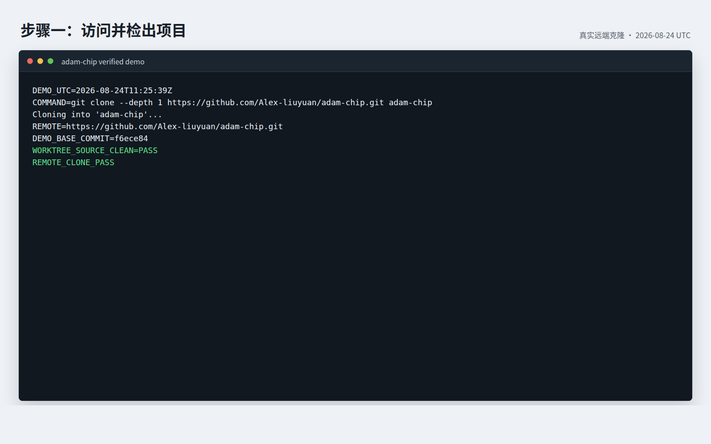
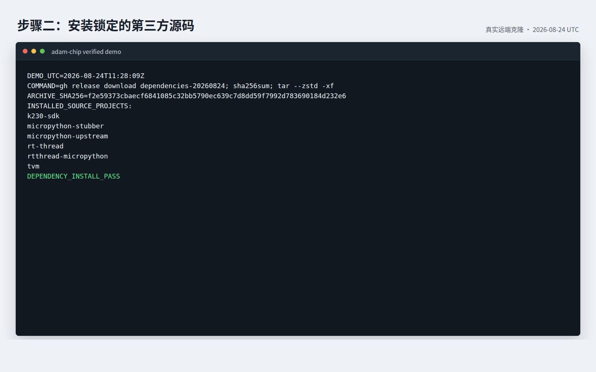
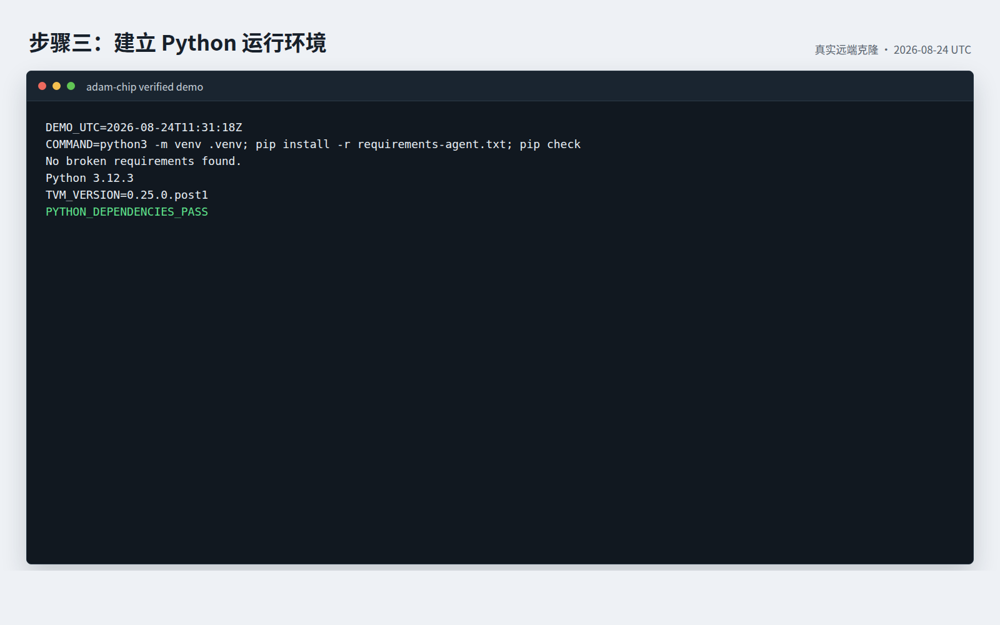
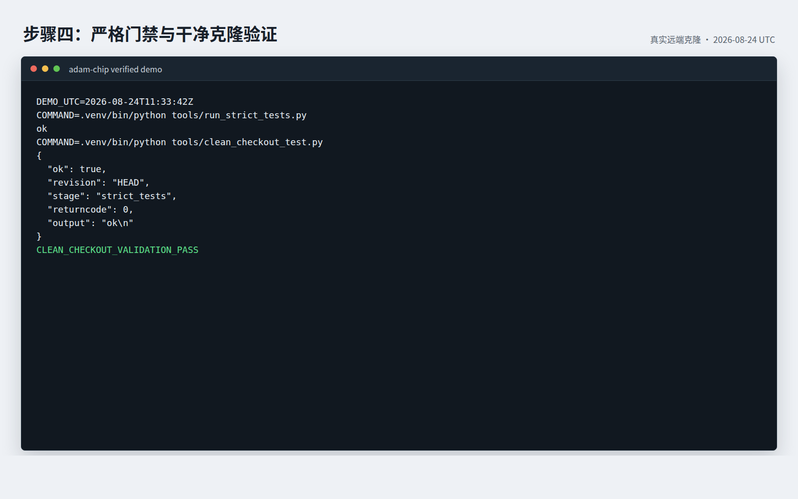
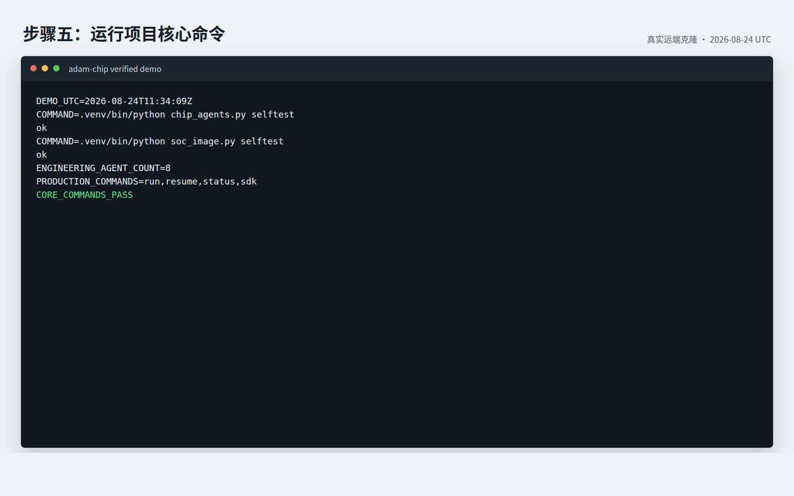
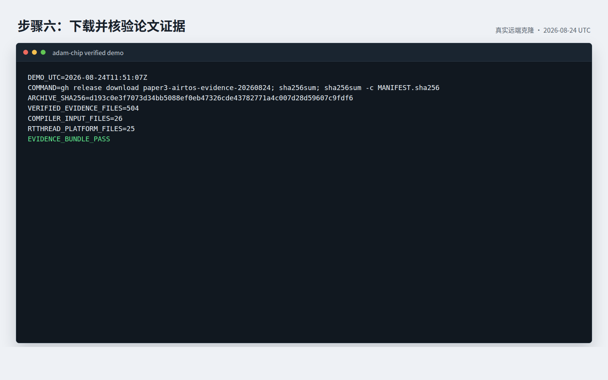
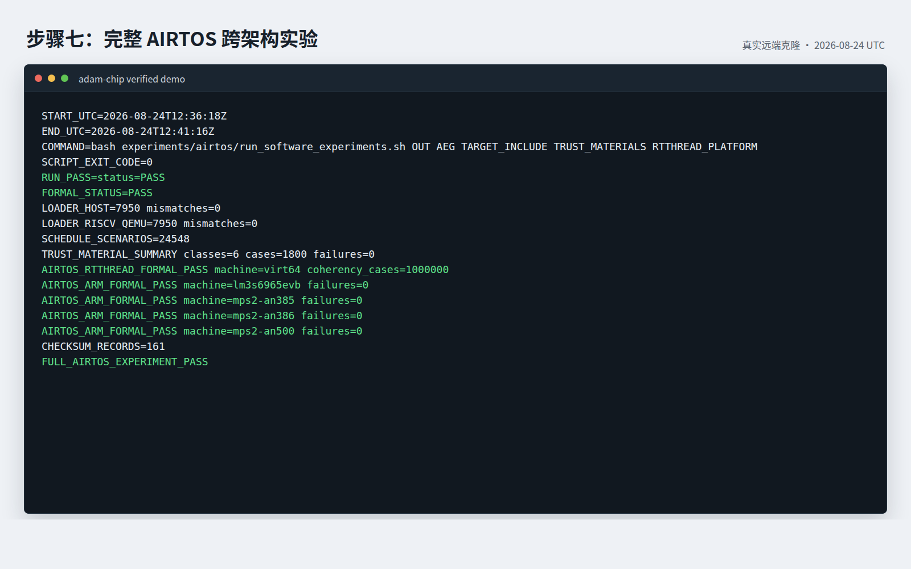

# Generic SoC Image Factory

This project builds a software image from SoC and board hardware materials. The
production entry point does not accept a vendor SDK, firmware image, defconfig,
toolchain path, operating-system choice, or prewritten target contract.

## 完整成功使用演示

以下记录来自 `2026-08-24` 对 GitHub 远端仓库的一次全新克隆，测试基线为
`f6ece84`。整个流程使用真实项目源码、锁定的第三方源码和已发布的论文证据，
没有使用模拟输入。原始文本日志保存在
[`docs/quickstart_demo/logs`](docs/quickstart_demo/logs)，便于搜索和复核。

### 步骤一：从 GitHub 检出项目

```sh
git clone --depth 1 https://github.com/Alex-liuyuan/adam-chip.git adam-chip
cd adam-chip
```

成功判据：远端地址正确、提交可检出且初始工作区干净。本次记录得到
`REMOTE_CLONE_PASS`。



### 步骤二：安装项目实际使用的第三方源码

```sh
gh release download dependencies-20260824 \
  --repo Alex-liuyuan/adam-chip \
  --pattern 'adam-chip-dependencies-20260824.tar.zst'
echo 'f2e59373cbaecf6841085c32bb5790ec639c7d8dd59f7992d783690184d232e6  adam-chip-dependencies-20260824.tar.zst' | sha256sum -c -
mkdir -p third_party
tar --zstd -xf adam-chip-dependencies-20260824.tar.zst \
  -C third_party --strip-components=2 \
  adam-chip-dependencies-20260824/sources
```

成功判据：压缩包摘要一致，RT-Thread、TVM、MicroPython 与 K230 SDK 等六个
锁定源码快照均解压完成。本次记录得到 `DEPENDENCY_INSTALL_PASS`。



### 步骤三：建立 Python 运行环境

```sh
python3 -m venv .venv
. .venv/bin/activate
python -m pip install --upgrade pip
python -m pip install -r requirements-agent.txt
python -m pip check
```

成功判据：依赖检查输出 `No broken requirements found.`。本次使用 Python
3.12.3，并得到 `PYTHON_DEPENDENCIES_PASS`。



### 步骤四：执行严格门禁和干净克隆验证

```sh
python tools/run_strict_tests.py
python tools/clean_checkout_test.py
```

成功判据：严格测试输出 `ok`，干净克隆验证返回 `"ok": true` 且退出码为
0。本次记录得到 `CLEAN_CHECKOUT_VALIDATION_PASS`。



### 步骤五：验证项目核心入口

```sh
python chip_agents.py selftest
python soc_image.py selftest
```

成功判据：两个入口都输出 `ok`，并能发现 8 个工程智能体以及
`run`、`resume`、`status`、`sdk` 四类生产命令。本次记录得到
`CORE_COMMANDS_PASS`。



### 步骤六：下载并核验论文实验材料

```sh
gh release download paper3-airtos-evidence-20260824 \
  --repo Alex-liuyuan/adam-chip \
  --pattern 'paper3-airtos-evidence-20260824.tar.zst'
echo 'd193c0e3f7073d34bb5088ef0eb47326cde43782771a4c007d28d59607c9fdf6  paper3-airtos-evidence-20260824.tar.zst' | sha256sum -c -
tar --zstd -xf paper3-airtos-evidence-20260824.tar.zst
cd paper3-airtos-evidence
sha256sum -c MANIFEST.sha256
cd ..
```

成功判据：归档摘要和文件清单全部通过。本次核验 504 个证据文件，其中包含
26 个编译复现输入和 25 个 RT-Thread 平台文件，得到
`EVIDENCE_BUNDLE_PASS`。



### 步骤七：运行完整 AIRTOS 跨架构软件实验

安装 `gcc-riscv64-linux-gnu`、`gcc-arm-none-eabi`、`qemu-user` 和
`qemu-system-arm` 后执行：

```sh
bash experiments/airtos/run_software_experiments.sh \
  /tmp/airtos-reproduction \
  paper3-airtos-evidence/reproduction-inputs/compiler_corrected/model.aeg \
  paper3-airtos-evidence/reproduction-inputs/target \
  paper3-airtos-evidence/reproduction-inputs/compiler_corrected \
  paper3-airtos-evidence/reproduction-inputs/rtthread_platform
```

成功判据：脚本退出码为 0，根目录、RISC-V 实时操作系统实验和四款 ARM
系统模型实验均产生 `RUN_PASS`。本次真实运行完成 7,950 个主机加载案例、
7,950 个 RISC-V QEMU 加载案例、24,548 个调度场景、1,800 个可信材料案例
和 1,000,000 次 RT-Thread 一致性检查；四款 ARM 模型均为零失败，共生成
161 条文件校验记录，最终得到 `FULL_AIRTOS_EXPERIMENT_PASS`。



这套演示覆盖不依赖实体开发板的完整复现流程。调用模型服务时需要使用者自己
提供接口密钥；实体 K230 的摄像头、双模型、温度和长期稳定性实验还需要论文
协议指定的开发板与测量仪器。密钥不会写入仓库，软件实验通过也不替代实体板
实验结论。

## Supported environment

- Linux x86-64 (Ubuntu 22.04/24.04 recommended)
- Python 3.11 or newer, Git, curl and a C compiler
- About 20 GB free space when all third-party sources and K230 tools are fetched

The repository contains project source, schemas, experiment programs, papers and
paper-facing evidence. `third_party/`, `build/`, `output/` and local credentials
are intentionally not versioned; they are recreated from the checked-in manifests.

## Install

```sh
git clone https://github.com/Alex-liuyuan/adam-chip.git
cd adam-chip
python3 -m venv .venv
. .venv/bin/activate
python -m pip install --upgrade pip
python -m pip install -r requirements-agent.txt
python tools/run_strict_tests.py
```

The last command must print `ok`. Core self-tests do not require a development
board, vendor image or model service.

Fetch the default pinned source dependencies only when building firmware or
running the simulator integrations:

```sh
sh scripts/fetch_third_party.sh
```

For the K230 platform backend and toolchain, use:

```sh
INCLUDE_PLATFORM_BACKENDS=1 sh scripts/fetch_third_party.sh
```

The redistributable source dependencies actually used by the project are also
mirrored as a locked GitHub release bundle. Authorized repository users can install
the six snapshots into `third_party/` without cloning them separately:

```sh
gh release download dependencies-20260824 \
  --repo Alex-liuyuan/adam-chip \
  --pattern 'adam-chip-dependencies-20260824.tar.zst'
echo 'f2e59373cbaecf6841085c32bb5790ec639c7d8dd59f7992d783690184d232e6  adam-chip-dependencies-20260824.tar.zst' | sha256sum -c -
mkdir -p third_party
tar --zstd -xf adam-chip-dependencies-20260824.tar.zst \
  -C third_party --strip-components=2 \
  adam-chip-dependencies-20260824/sources
```

This bundle contains the locked RT-Thread, TVM, RT-Thread MicroPython,
MicroPython build-tool subset, MicroPython Stubber subset and K230 SDK source.
It includes `BUNDLE_MANIFEST.json`, all retained license notices and a per-file
`SHA256SUMS` manifest. `canmv-k230`, the K230 binary toolchain and OpenMV are not
mirrored because their declared redistribution status requires vendor clearance,
toolchain-license review or file-level review. Fetch those only from their official
locations through `scripts/fetch_third_party.sh` when the corresponding workflow
requires them.

Large dependencies are downloaded into `third_party/`. Their expected revisions
and artifact hashes are recorded in `third_party.lock.json`; available groups and
licensing boundaries are recorded in `third_party.manifest.json`.

## Model service configuration

The production Agent workflow needs an OpenAI-compatible model endpoint. Keep the
key in the environment, never in Git:

```sh
cp config/llm.example.json config/llm.local.json
export DMXAPI_API_KEY='your-key'
python chip_agents.py model-config
python chip_agents.py model-ping
```

Set `ADAM_LLM_BASE_URL` and `ADAM_LLM_MODEL` to use another compatible provider.
Commands with a `--no-model` option can exercise deterministic engineering paths
without network model calls.

## Start a run

```sh
python3 soc_image.py run \
  --material /path/to/soc-manual.pdf \
  --material /path/to/board-schematic.pdf \
  --out runs/board-a
```

The intake stage copies each material into the run by content hash and writes
`materials.lock.json`. It then writes `hardware_ir.json`, `unknowns.json`,
`conflicts.json`, `reference_profile.json`, `software_requirements.json`, `plan.json`, and `state.db`. PDF and image observations stay
as non-executable candidates; only provenance-bound SVD/DTS facts can enable a
capability. Agent attempts run in isolated Git worktrees under `candidates/`;
verified patches are promoted into the run-local `integration/` tree and
snapshotted by hash under `artifacts/`. Repeating the command is allowed only
when every input hash matches the existing lock.

```sh
python3 soc_image.py status --run runs/board-a
python3 soc_image.py resume --run runs/board-a
```

`run` is the only production entry point. It creates `runs/board-a/adaptation-repository/chip`, then every planned
capability is executed by its engineering Agent in an isolated Git worktree. The deterministic generators provide only
an initial scaffold; each Agent must inspect sources, adapt code and run engineering checks. A failed check gets one
bounded repair round. Verified Agent outputs are synchronized into the five SYSUOS provider contracts.

`sdk init-soc` remains an SDK authoring utility for an exported kit. It is not a second production workflow.

Later stages derive the hardware contract, software capabilities, target
sources, image, simulation and board-validation plan from this locked input.

## Reference artifacts

The existing K230 `sdk.img` is a black-box regression reference. Its manifest
sets `build_input_allowed=false`; it must never provide a boot region, partition
payload, overlay base, firmware component or other input to a generated image.

The former K230/CanMV pipeline remains temporarily available for baseline
regression while the staged migration proceeds. It is not the production entry
point and cannot be reached from `soc_image.py`.

## Checks

```sh
python3 tools/run_strict_tests.py
python3 tools/clean_checkout_test.py
```

The clean-checkout test creates a temporary Git worktree and verifies that the
committed files alone pass the strict gate. Run it after committing local changes.

## AIRTOS experiments and K230 hardware

The four AIRTOS experiment protocols, required packages, exact commands, metrics
and conclusion boundaries are documented in
`docs/paper_orchestra_trilogy/paper3_airtos/experiment_protocol.md`. Archived
results are indexed by
`docs/paper_orchestra_trilogy/paper3_airtos/EXPERIMENT_RESULTS_INDEX.md`.

Host/QEMU experiments require the corresponding Ubuntu cross compilers and QEMU
packages (`gcc-riscv64-linux-gnu`, `gcc-arm-none-eabi`, `qemu-user` and
`qemu-system-arm`). Physical K230 experiments additionally require the named board,
camera, flashed image and stable `/dev/serial/by-id/...` devices described by the
protocol. Hardware scripts do not fabricate a pass when a board or instrument is
absent.

The complete local Paper 3 evidence archive and exact v1 reproduction inputs are
published separately from Git source. Authorized repository users can download and
verify them as follows:

```sh
gh release download paper3-airtos-evidence-20260824 \
  --repo Alex-liuyuan/adam-chip \
  --pattern 'paper3-airtos-evidence-20260824.tar.zst'
echo 'd193c0e3f7073d34bb5088ef0eb47326cde43782771a4c007d28d59607c9fdf6  paper3-airtos-evidence-20260824.tar.zst' | sha256sum -c -
tar --zstd -xf paper3-airtos-evidence-20260824.tar.zst
```

After installing the QEMU/cross-compiler packages, rerun the full software suite
with the extracted inputs:

```sh
bash experiments/airtos/run_software_experiments.sh \
  /tmp/airtos-reproduction \
  paper3-airtos-evidence/reproduction-inputs/compiler_corrected/model.aeg \
  paper3-airtos-evidence/reproduction-inputs/target \
  paper3-airtos-evidence/reproduction-inputs/compiler_corrected \
  paper3-airtos-evidence/reproduction-inputs/rtthread_platform
```

## Repository map

- `soc_image.py`: production hardware-material intake and run lifecycle
- `agents/`, `engine/`, `socimage/`: orchestration and image-generation core
- `platforms/`, `bsp/`, `boot/`, `products/`: target and product implementations
- `compiler/`: edge-AI compilation and acceleration-plan support
- `experiments/airtos/`: executable AIRTOS experiment sources and runners
- `docs/`: project documentation, three-paper design and experiment evidence
- `tools/`: validation, build, simulation, release and supply-chain tools

See `docs/README.md` for the three-paper index and
`docs/PROJECT_FILE_ORGANIZATION.md` for file ownership and evidence-retention rules.

Implementation phases are ordered by `tools/phase_gate.py`. A phase cannot
begin unless the preceding phase report passed and is bound to the current Git
commit.
