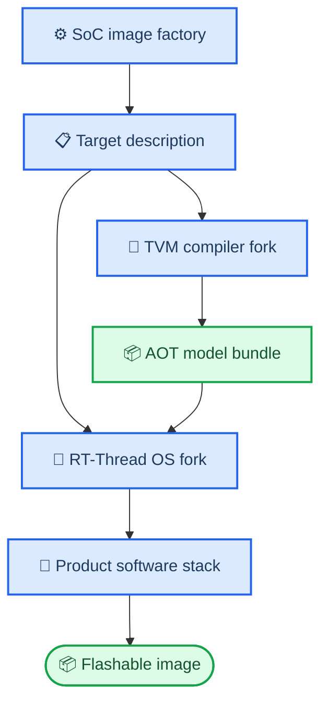

# 多 Agent 驱动的通用 SoC 软件生态自动构建

_面向论文与工程实施的统一方案 · 2026-08-04_

---

## 摘要

本文研究如何让项目内多 Agent 从芯片手册、板级原理图、引脚图、DTS/SVD 和可获取的上游源码出发，自动完成启动链、RT-Thread BSP、设备驱动、AI 编译后端、产品运行时和可烧录镜像。研究重点不是让 Agent 生成更多代码，而是把跨层移植建模为可执行的动态移植图：每个硬件实例对应所需软件接口、所选上游版本、适配差异、构建命令和板级测试；编译、仿真、烧写、串口采集和性能测量由确定性工具执行，Agent 负责解释材料、选择复用源、修改源码和根据失败重新规划。

当前项目已具备材料锁定、Hardware IR、静态 capability DAG、隔离 worktree 和若干生成器，但生产入口仍主要调用固定 Python 模板，真正能修改源码的 `DevelopmentEngine` 尚未成为主调度器。本文提出以 RT-Thread 和 Apache TVM 的真实 fork/patch series 为核心资产，以 QEMU/Renode 和物理 HIL 为闭环，以 CanMV-K230 官方镜像只作为同板功能与性能黑盒基线。论文用跨芯片留一验证衡量首启时间、功能覆盖、人工介入、移植收敛和适配知识复用，不把普通多 Agent 协作本身包装成创新。

**关键词：** SoC 软件生态；多 Agent 软件工程；RT-Thread；Apache TVM；自动移植；硬件在环

## 📋 研究定位

### 问题定义

通用 SoC 软件镜像不是单一编译任务。启动地址、时钟和复位决定 BSP；中断、DMA 和 cache 决定驱动与张量内存；NPU 命令 ABI 决定 TVM 后端；摄像头、显示、网络和 MicroPython 决定产品功能。固定流水线无法预先枚举所有 IP 实例和适配关系，而只依赖语言模型自由生成代码又无法稳定完成构建和真板调试。

MetaGPT、ChatDev、SWE-agent 和 OpenHands 已经证明角色化协作、仓库操作和测试反馈是可实现的软件工程模式，因此“使用多个 Agent”本身不是本文贡献。[^1][^2][^3] 本文研究的是更窄的问题：如何把异构硬件材料转化为跨 Boot、BSP、driver、OS、compiler、runtime 和 image 的可执行移植图，并让多 Agent 在真实工具链和物理板反馈下收敛。

### 研究问题

1. **RQ1：** 动态移植图能否比固定 capability DAG 覆盖更多未见 SoC/IP 组合？
2. **RQ2：** coherent source stack 与 IP-family adapter 复用能否降低首启和首个外设可用时间？
3. **RQ3：** 编译、仿真和 HIL 反馈驱动的多 Agent 修复能否降低人工介入并提高端到端功能覆盖？
4. **RQ4：** RT-Thread 内核改造和 TVM 后端改造能否作为可迁移资产，在第二、第三款芯片上复用而非重新生成？

### 输入边界

用户最少应提供 SoC TRM、数据手册、板级原理图、引脚图和启动介质信息。DTS、SVD、寄存器表、DDR 初始化代码、NPU 命令 ABI 或厂商编译器并非总能从 PDF 推导；缺少这些信息时，系统只能选择已授权的上游实现、生成待验证适配，或明确报告该能力不可完成，不能臆造寄存器与闭源协议。

本文不承诺“任意 PDF 一键得到完整镜像”。它研究的是在输入充分度、可获取源码和硬件可观测性明确的条件下，最大化自动完成比例并准确定位剩余阻塞。

## 🔍 当前项目诊断

### 已有能力与真实缺口

| 模块 | 当前真实实现 | 工程判断 | 改造动作 |
| --- | --- | --- | --- |
| 生产调度 | `Engine` 展开固定 capability | 可复现但不自适应 | 改为实例级动态任务图 |
| 自主编码 | `DevelopmentEngine` 可调用编码 Agent | 未接入生产 DAG | 合并为唯一执行器 |
| 角色目录 | `agents/catalog.py` 维护固定顺序 | 与 `engine` 双控制面 | 迁移到动态角色路由 |
| BSP | QEMU virt64 模板为主 | 不是新芯片移植器 | 操作真实 RT-Thread fork |
| 驱动 | UART/PLIC/CLINT/DMA 模板 | IP family 覆盖过窄 | 建立实例级 adapter 库 |
| AI OS | 独立 C 组件加薄端口 | 尚未改 RT-Thread 内核 | 实现 kernel/component patch |
| AI 编译 | `Add+ReLU` CPU/RVV 原型 | 不是通用 TVM backend | 实现 Pass、runner 和 runtime |
| HIL | 模拟设备路径为主 | 无法支持产品结论 | 接入烧写、串口、功耗和外设工装 |

上述判断可由当前入口 [`soc_image.py`](../../soc_image.py)、静态计划器 [`engine/control.py`](../../engine/control.py)、自主开发旁路 [`engine/development.py`](../../engine/development.py)、TVM 原型 [`engine/tvm_templates/compiler.py`](../../engine/tvm_templates/compiler.py) 和 RT-Thread 薄端口 [`engine/rt_ai_templates/os/rt_ai_port_rtthread.c`](../../engine/rt_ai_templates/os/rt_ai_port_rtthread.c) 直接复核。

### 应削减的设计

- 暂停扩展尚未绑定真实源码改造和实机闭环的抽象协议、复杂 schema 与模拟 mutation corpus
- 删除 `engine` 与旧 `agents` 的重复编排，只保留一个生产状态机
- 停止把固定模板复制到 `generated/` 视为“操作系统或编译器已生成”
- 将版本锁定、来源记录和发布检查保留为工程卫生，不作为三篇论文的核心科学叙事
- 将 CanMV 官方镜像限制为黑盒兼容性基线，不把其分区内容或二进制作为新镜像输入

### 必须补足的设计

- 可表达 clock/reset/power/pinmux/DDR/interrupt/DMA/cache 拓扑的 Hardware IR
- 从 DTS compatible、Kconfig、符号表和构建脚本提取的 Repository IR
- 可执行的 `PortingDelta`，而不是只生成 source discovery 报告
- 对 RT-Thread 与 TVM 锁定上游版本执行 patch series 的 fork 构建器
- 串口、JTAG、功耗计、摄像头、显示和网络测试的物理 HIL runner
- 失败签名到领域任务的路由，以及可跨芯片复用的 adapter 知识库

## ⚙️ 系统架构

### 端到端闭环

```mermaid
flowchart LR
    accTitle: Multi-Agent SoC Build Loop
    accDescr: Hardware materials are converted into a dynamic porting graph, implemented by domain agents, and repaired using deterministic build, simulation, and board feedback.

    materials(["📥 Hardware materials"]) --> hardware_ir["⚙️ Build Hardware IR"]
    hardware_ir --> source_stack["🔍 Resolve source stack"]
    source_stack --> porting_delta["📋 Compute porting delta"]

    subgraph agents ["👥 Domain agents"]
        plan_tasks["🧠 Plan instance tasks"] --> patch_sources["✏️ Patch upstream sources"]
        patch_sources --> integrate_stack["🔗 Integrate software stack"]
    end

    subgraph tools ["🔧 Deterministic tools"]
        build_image["⚙️ Build image"] --> simulate["🧪 Run simulation"]
        simulate --> hil_test["🧪 Run board HIL"]
    end

    porting_delta --> plan_tasks
    integrate_stack --> build_image
    hil_test --> capability_check{"🔍 Functions pass?"}
    capability_check -->|No| failure_ir["📤 Emit Failure IR"]
    failure_ir --> plan_tasks
    capability_check -->|Yes| release(["📦 Release image"])

    classDef input fill:#f3f4f6,stroke:#6b7280,stroke-width:2px,color:#1f2937
    classDef process fill:#dbeafe,stroke:#2563eb,stroke-width:2px,color:#1e3a5f
    classDef success fill:#dcfce7,stroke:#16a34a,stroke-width:2px,color:#14532d

    class materials input
    class hardware_ir,source_stack,porting_delta,plan_tasks,patch_sources,integrate_stack,build_image,simulate,hil_test,failure_ir process
    class release success
```



### 五个核心数据对象

| 对象 | 最小字段 | 生产者 | 消费者 |
| --- | --- | --- | --- |
| `HardwareIR` | IP、地址、IRQ、clock、reset、DMA、cache | Material Agent + parser | Planner、BSP、driver |
| `RepositoryIR` | revision、compatible、Kconfig、symbols、ABI | Source Scout + scanner | Stack Solver |
| `PortingTask` | instance、interface、source、adaptation、tests | Porting Planner | Domain Agent |
| `FailureIR` | stage、signature、log slice、suspect edges | Build/HIL tools | Triage + Planner |
| `CapabilityResult` | API case、board、status、latency、artifact | Test runner | Product Integrator |

任务键应从固定名称改为实例化四元组：

\[
K_t=(i_{hw},\ I_{sw},\ R_{src},\ A_{kind})
\]

例如 `uart3 + rt_serial_device + rt-thread@rev + clock/pinmux/MMIO adaptation`，或 `npu0 + tvm_external_codegen + vendor-runtime@rev + command-buffer adaptation`。同类 IP 的历史任务可以作为新任务的检索与补丁起点，但必须重新编译和板测。

### Agent 角色与工具边界

| Agent | 负责判断 | 必须交付 | 不得替代的工具 |
| --- | --- | --- | --- |
| Material Agent | 解释材料与冲突 | `HardwareIR` patch | PDF/SVD/DTS parser |
| Source Scout | 选择 coherent stack | `RepositoryIR`、版本建议 | clone、license、symbol scan |
| Porting Planner | 拆分依赖与修复路径 | `PortingTask[]` | DAG、预算、状态数据库 |
| Boot/BSP Agent | startup、DDR、trap、clock | RT-Thread BSP patch | cross build、boot probe |
| Driver Agent | IP-family 适配 | driver/Kconfig/test patch | MMIO simulation、HIL |
| RT-Thread Agent | scheduler、memory、IPC、LWP | OS patch series | kernel build/test |
| TVM Agent | Relax/TIR/backend/runtime | TVM patch series | model diff、board runner |
| Product Agent | MicroPython/media/API | product integration patch | API regression |
| Triage Agent | 解释失败并重规划 | `FailureIR` classification | log capture、fault injection |

Agent 可以提出命令和补丁，但不能伪造编译、启动、测试和性能结果。确定性 runner 是系统执行主体；多 Agent 是受任务合同约束的源码工程团队。

### 生产执行状态机

生产入口只保留一套持久化状态机。每个 `PortingTask` 必须记录 `repo/revision/worktree/patch/build_target/test_set/owner/attempt`，而不是只记录 capability 名称：

```text
DISCOVERED -> PLANNED -> IMPLEMENTING -> BUILDING
           -> SIMULATING -> HIL_TESTING -> ACCEPTED
                    \-> FAILED -> REPAIRING -/
```

`IMPLEMENTING` 阶段由领域 Agent 在隔离 worktree 产生源码 patch；其余状态只能由确定性 runner 根据进程退出码、结构化测试结果和设备观测更新。补丁通过任务自带的回归集后才合入芯片系列 patch series；失败则保留 worktree、日志和最小失败签名，并生成下一轮修复任务。调度器重启后从状态数据库继续，不能依赖对话上下文恢复生产状态。

### 动态规划与修复策略

设当前状态为 \(S=(H,R,T,F,C)\)，分别表示硬件模型、源栈、未完成任务、失败集合和已通过能力。调度器选择 Agent-工具动作 \(a\) 时优化：

\[
a^*=\arg\max_a
\frac{\mathbb E[\Delta Coverage(a)] + \lambda\mathbb E[\Delta Reuse(a)]}
{Cost_{build}(a)+Cost_{hil}(a)+Cost_{agent}(a)}
\]

期望值只能来自历史任务与本次可观测结果，不能由语言模型自报。失败后优先修改能解释该失败的最小依赖子图；同一失败签名连续重复时，Planner 必须更换假设、source candidate 或测试手段，而不是无限重试相同补丁。

## 🔗 三篇论文的工程接口

### 软件栈关系



TVM 编译器直接输出可执行产品接口：模型常量、CPU/RVV 目标代码、NPU 子图、静态 tensor arena 布局、DMA/coherency 动作、异步段描述和调优记录。RT-Thread 消费这些信息，提供 `submit/wait/cancel`、buffer allocation、device fence、deadline/budget 和故障恢复。

跨层 ABI 只保留执行需要的字段：

```c
struct ai_segment_desc {
    uint16_t op_group;
    uint8_t device;
    uint8_t flags;
    uint32_t code_offset;
    uint32_t workspace_offset;
    uint32_t workspace_size;
    uint32_t estimated_cycles;
};
```

任何安全审计、hash 和版本信息均放在发布 manifest，不侵入调度算法和论文主假设。

## 🔧 项目改造路线

### 目标目录

```text
chip/
  hardware_ir/                 # executable SoC/board/IP topology
  adapters/                    # reusable boot, IP, driver and media adapters
  os/rtthread_ai/
    upstream.lock
    patches/kernel/
    components/rt_ai/
    ports/
  compiler/tvm_rtthread/
    upstream.lock
    patches/
    backends/
    runtime/
  agents/domain/               # role prompts and task schemas
  engine/
    planner/                   # dynamic porting graph
    runners/                   # build, sim, HIL and benchmark
    triage/                    # FailureIR extraction and routing
  benchmarks/soc_porting/
  products/<board>/
```

上游 RT-Thread 和 TVM 保持只读 revision；构建器在临时 worktree 应用项目 patch series。这样既是真实改造，又能持续 rebase 和审查，不再把模板副本误认为 fork。

### 七个里程碑

| 阶段 | 核心工作 | 可运行出口 | 完成判据 |
| --- | --- | --- | --- |
| M0 | 合并双控制面 | 单一 task runner | `soc_image.py` 调用开发 Agent |
| M1 | 扩展 Hardware/Repository IR | 动态实例任务 | QEMU virt64 从材料建图 |
| M2 | RT-Thread fork 基线 | 可启动 BSP | 真板 UART/timer/IRQ/SD |
| M3 | TVM fork 基线 | RT-Thread AOT 推理 | CPU/RVV 模型通过数值测试 |
| M4 | 异构 AI 协同 | NPU/DMA async path | camera-to-inference-to-display |
| M5 | 产品功能闭环 | 可烧录 `sdk.img` | K230 功能矩阵通过 |
| M6 | 跨芯片验证 | 第二、三平台镜像 | leave-one-SoC-out 完成 |

M0-M1 先解决自动工程系统；M2-M4 产生两篇系统/编译器论文的真实实现；M5-M6 才支持“通用 SoC 软件生态自动构建”的论文与产品结论。

### 首轮代码改动顺序

1. 将 `source_discovery` 产生的 adapter 差异转成 `PortingTask[]`
2. 让 `Engine` 调用 `DevelopmentEngine` 执行非模板任务
3. 将 `agents/catalog.py` 角色映射迁移到 capability instance 路由后删除旧编排
4. 建立 RT-Thread 与 TVM 的 upstream lock、patch apply 和 rebase 测试
5. 用同一 runner 构建 QEMU virt64、K230 和第二块开发板
6. 接入可编程电源、串口、烧写、摄像头/显示回环和功耗采集
7. 用官方 CanMV 行为测试补齐产品 API，但不复制官方镜像内容

## 🧪 实验设计

### ADAM-SoCPortBench

正式 benchmark 至少包含三类环境：QEMU/Renode 可观测虚拟平台、CanMV-K230 物理板、另一厂商且不同体系结构的 RT-Thread 物理板。扩展实验应达到 6 个 SoC，其中开发集与留出集按 SoC family 隔离，避免同一 BSP 轻微改名造成数据泄漏。

每个平台冻结以下任务：首启、console、timer、IRQ、GPIO、I2C、SPI、DMA、storage、network、camera/display、MicroPython、CPU AI、向量 AI、NPU AI 和最终镜像升级。K230 的官方镜像只提供功能名称、API 行为、数值输出、延迟和稳定性基线。

### 对照组

| 基线 | 保持相同 | 改变因素 | 回答问题 |
| --- | --- | --- | --- |
| 固定 DAG | 模型、工具、预算 | 无动态任务 | 动态图价值 |
| 单 Agent | 工具与 token | 无领域分工 | 多 Agent 价值 |
| 无知识库 | 相同 Agent | 禁用 adapter 检索 | 跨芯片复用价值 |
| 仅编译 | 相同补丁 | 无 sim/HIL 反馈 | 物理反馈价值 |
| 人工专家 | 相同材料与硬件 | 人工移植 | 工程效率参照 |

Agent 数量不能作为自变量替代能力；所有自动组必须使用相同模型、最大 token、工具权限、构建机和墙钟预算。

### 指标与统计

- `time_to_first_boot`、`time_to_first_peripheral` 和 `time_to_image`
- capability pass rate 与按启动/驱动/OS/compiler/product 分层覆盖率
- 人工询问次数、人工修改分钟数和无法自主定位的失败数
- Agent 尝试数、有效补丁率、revert 率和失败签名收敛轮数
- reused/adapted/generated LoC，以及 adapter 在留出 SoC 的命中率
- 真板启动成功率、24 h 稳定性、性能相对厂商基线的差距

每个自动条件至少运行 5 个随机 seed；时间和尝试数报告中位数、四分位距与分层 bootstrap 95% CI。二元成功率使用按 SoC 分层的混合效应 logistic 模型；时间指标使用生存分析处理预算耗尽。不能只报告成功案例。

### 预注册假设

- **H1：** 动态移植图在留出 SoC 上提高 capability pass rate，且不会增加人工修改时间
- **H2：** adapter 知识库使 `time_to_first_peripheral` 的中位数至少下降 20%
- **H3：** build+simulation+HIL 闭环减少同一失败签名的重复轮数
- **H4：** 多 Agent 在相同预算下优于单 Agent；若差异不显著，则保留更简单的单 Agent 路径

阈值必须在运行 benchmark 前冻结。H4 明确允许多 Agent 假设被否证，避免把系统架构选择写成预定结论。

## 👥 多 Agent 自主实施方式

项目而不是外部操作者完成镜像制作。一次生产 run 的用户交互只包括提供材料、连接硬件和在确实缺少闭源资料时补充文件；其余动作由项目内团队执行：

1. Material 与 Source Scout Agent 形成硬件/源码候选
2. Planner 生成实例化任务并按依赖并行调度
3. 各领域 Agent 在隔离 worktree 修改真实上游源码或项目 adapter
4. runner 自动编译、仿真、烧写、重启、采集串口与外设结果
5. Triage Agent 把失败转换为 `FailureIR` 并重排任务
6. Product Agent 运行官方能力兼容测试和项目新增 AI 测试
7. Release Agent 只在全部必需功能通过后组装可烧录镜像

缺少材料时，Agent 必须输出具体缺项，例如 `DDR training binary`、`NPU command ABI` 或 `CSI PHY sequence`，而不是要求用户自己完成相应开发。用户补充材料后，同一 run 从阻塞任务继续。

## ⚠️ 可证伪边界

- 如果系统只能在预置 K230 模板上成功，论文不能声称通用 SoC 自动构建
- 如果 RT-Thread 和 TVM 上游源码没有实质 patch，不能声称完成原生 AI OS/编译器改造
- 如果 QEMU 通过但物理外设失败，相关 capability 必须记为失败
- 如果多 Agent 在相同预算下不优于单 Agent，应删去“协作增益”贡献，只保留动态移植图与工程框架
- 如果生成镜像依赖官方镜像 payload，不能作为独立构建结果
- 如果缺少 NPU ABI，只能发布 CPU/RVV 功能和 NPU 阻塞说明，不能把 fallback 称为 NPU 支持

这组边界保证论文结论来自实际移植与实验，而不是系统命名、Agent 对话数量或模板文件数量。

## 🔗 参考资料

[^1]: Hong, S. et al. (2024). "MetaGPT: Meta Programming for Multi-Agent Collaborative Framework." _ICLR_. <https://arxiv.org/abs/2308.00352>

[^2]: Qian, C. et al. (2024). "ChatDev: Communicative Agents for Software Development." _ACL_. <https://doi.org/10.18653/v1/2024.acl-long.810>

[^3]: Yang, J. et al. (2024). "SWE-agent: Agent-Computer Interfaces Enable Automated Software Engineering." _NeurIPS_. <https://arxiv.org/abs/2405.15793>

[^4]: RT-Thread Project. (2026). "RT-Thread source tree at the project-pinned revision." <https://github.com/RT-Thread/rt-thread/tree/f42337ba03a7b39d089e561bf68f28378f93c46e>

[^5]: Apache TVM Project. (2026). "Apache TVM source tree at the project-pinned revision." <https://github.com/apache/tvm/tree/453070e1bb4babb7d6bc2b28f976368146d76ec8>

[^6]: Jimenez, C. E. et al. (2024). "SWE-bench: Can Language Models Resolve Real-World GitHub Issues?" _ICLR_. <https://arxiv.org/abs/2310.06770>

---

_本文以真实源码 patch、自动构建修复和跨芯片真板结果为中心；发布完整性检查只作为常规工程实践。_
