# 基于 Apache TVM 改造的 RT-Thread 原生 AI 编译器

_面向真实 TVM fork、异构 AOT 和硬软协同实验的工程方案 · 2026-08-04_

---

## 摘要

本文提出一套基于 Apache TVM 实质改造的嵌入式 AI 编译器。输入是 ONNX/Relax 模型和由 SoC 材料生成的 target contract；输出是可直接链接进 RT-Thread 镜像的 CPU/RVV 目标代码、NPU 子图 blob、常量、静态 tensor arena、异步执行段和板端调优记录。编译器在 Relax 层完成量化感知的异构分区和数据搬运插入，在 S-TIR 层完成循环变换、TensorIntrin 和目标指令 lowering，在 MetaSchedule 中使用真实开发板 runner 搜索调度，在 external codegen 中接入开放 NPU ISA 或锁定版本的厂商编译器。

当前项目已经真实调用 TVM 的 ONNX frontend、Relax pass、S-TIR tensorize 和 C codegen，但工作负载只有固定 `Add+ReLU`；MetaSchedule 只构造空数据库，BYOC 只探测 API，RVV 性能数据是预置常数，RT-Thread 端也没有 TVM runtime。这些代码是 API 可用性原型，不是可发表的编译器实现。本文的科学问题是：RTOS 的 deadline、tensor memory、DMA/coherency 和设备竞争信息进入 TVM 搜索后，能否在保持数值正确性的前提下降低尾延迟、能耗和峰值内存，并把同一编译框架移植到不同 SoC。

**关键词：** Apache TVM；Relax；TensorIR；MetaSchedule；RISC-V Vector；异构编译；RT-Thread

## 📋 研究定位

### 现有技术与研究空位

TVM 已经建立从计算图到张量程序和目标代码的端到端优化框架，Ansor 与 MetaSchedule 类方法使用测量和代价模型搜索调度，TensorIR 提供可组合的张量化抽象。[^1][^2][^3] BYOC/External Library Dispatch 已经提供图模式匹配、子图合并、外部 codegen 和 runtime module 的扩展路径。[^4] DORY、Deeploy 和 TFLM 等工作也已证明静态内存、tiling、DMA 与 MCU 级部署是成熟研究方向。[^5][^6]

因此，本文不能把“使用 TVM”“支持 RVV”“考虑内存”或“调用 NPU”单独作为创新。可研究的空位是将以下机制统一到同一编译闭环：

- 从硬件材料自动生成、可用于 TVM pass 的 target contract
- 面向 RT-Thread 异步资源和 tensor arena 的图分区、内存规划与执行段生成
- 同时优化单模型延迟、共享设备下尾延迟、能耗和内存的板端 MetaSchedule
- 用标准 TensorIntrin 与受控 inline assembly 实现可移植 RVV 微内核
- 在没有开放 NPU 命令 ISA 时，合法接入厂商编译器而不假装是 TVM 原生 codegen

### 研究问题

1. **RQ1：** RT-Thread 资源竞争和 deadline-aware cost model 能否优于只优化单算子平均延迟的 TVM 基线？
2. **RQ2：** 联合图分区、数据搬运和静态 tensor arena 规划能否降低端到端尾延迟与峰值内存？
3. **RQ3：** RVV TensorIntrin、目标调度规则和受控 inline assembly 能否在不同 VLEN/shape 上稳定优于通用 LLVM lowering？
4. **RQ4：** 同一 external codegen/runtime ABI 能否同时承载开放 NPU 后端与厂商编译器适配器？

### 论文主张边界

本文研究 inference compiler，不包含训练编译、自动模型设计和通用语言编译。QEMU 只用于指令与数值正确性；所有性能结论必须来自频率、内存配置和温度策略固定的物理板。若 K230 NPU 命令 ABI 不开放，则 K230 路径只能称为 TVM external-codegen-to-vendor-toolchain，不能称为 TVM 直接生成 KPU 指令。

## 🔍 当前代码审计

### 已经真实实现的部分

当前 [`engine/tvm_templates/compiler.py`](../../engine/tvm_templates/compiler.py) 确实执行了以下流程：

- 用 `tvm.relax.frontend.onnx.from_onnx` 导入模型
- 执行 `DecomposeOpsForInference`、`LegalizeOps`、`FuseOps` 和 `FuseTIR`
- 注册 S-TIR TensorIntrin，并对固定 8 元素 `Add+ReLU` 执行 `tensorize`
- 用 C codegen 产生 CPU/RVV 源码并交叉编译
- 在 QEMU 中执行并与 ONNX Runtime 进行数值比较
- 检查反汇编中是否存在预期 RVV 指令

这些结果说明工具链路径可用，是后续开发的可靠起点。

### 仍属于探针或占位的部分

| 模块 | 当前行为 | 不能支持的结论 | 必需改造 |
| --- | --- | --- | --- |
| 模型 | 固定 `Add+ReLU [1,8]` | 通用模型支持 | 导入模型 corpus |
| MetaSchedule | 创建 `MemoryDatabase` | 已完成自动调优 | board runner + trials |
| cost DB | 写入 `10us/4us` 常数 | RVV 实际更快 | 物理实测数据库 |
| BYOC | 构造 pattern 对象 | NPU codegen 可用 | partition/codegen/runtime |
| RVV | 单个外部 C 函数 | TVM 全算子 RVV 后端 | intrin catalog + schedule rules |
| memory | 固定 64-byte arena | 静态内存优化 | liveness/bank/DMA planner |
| runtime | 自定义 AEG loader | TVM 与 RT-Thread 集成 | 静态 AOT ABI |
| 性能 | QEMU 运行 | 板级 speedup | 同板 benchmark runner |
| 构建身份 | checkout 与已安装 wheel 分离 | 锁定源码已被执行 | 从精确 checkout 构建并核对运行库 |

项目锁定的 TVM revision 为 `453070e1bb4babb7d6bc2b28f976368146d76ec8`。当前 `engine/tvm_ai_tools.py` 虽把该 checkout 的头文件路径传给编译器，却直接导入环境中的 `tvm` Python 包；在记录 `tvm.__file__`、`libtvm` 路径、build config 与源码 commit 一致之前，不能断言执行的就是锁定源码。

该 revision 是 TVM `0.25` 风格的 Relax/S-TIR 栈：存在 `tvm.tirx`、`tvm.s_tir` 和 `tvm.s_tir.meta_schedule`，不存在旧版 `tvm.tir`、Relay、顶层 `tvm.meta_schedule` 以及旧教程常见的 `src/runtime/crt`/microTVM 目录。[^7] 实施必须针对这一套 API，不回退到旧 TVM 形成两套编译栈。

## ⚙️ 编译器架构

### 编译流水线

```mermaid
flowchart LR
    accTitle: TVM RT-Thread Compiler Pipeline
    accDescr: Models and hardware contracts flow through Relax partitioning, S-TIR optimization, board-based MetaSchedule, static memory planning, and target-specific AOT packaging.

    model(["📥 ONNX or Relax model"]) --> normalize["⚙️ Normalize graph"]
    target(["📋 Target contract"]) --> annotate["🏷️ Annotate capabilities"]
    normalize --> annotate
    annotate --> partition["🔍 Partition heterogeneous graph"]

    subgraph cpu_path ["🖥️ CPU and RVV path"]
        lower_tir["⚙️ Lower to S-TIR"] --> tensorize["⚡ Apply TensorIntrin"]
        tensorize --> tune["🧪 Tune on board"]
    end

    subgraph npu_path ["🔌 NPU external path"]
        lower_npu["⚙️ Lower NPU subgraph"] --> vendor_compile["🔧 Compile device blob"]
    end

    partition --> lower_tir
    partition --> lower_npu
    tune --> memory_plan["💾 Plan tensor arena"]
    vendor_compile --> memory_plan
    memory_plan --> emit_aot["📦 Emit RT-Thread AOT"]
    emit_aot --> board_test(["🧪 Execute model tests"])

    classDef input fill:#f3f4f6,stroke:#6b7280,stroke-width:2px,color:#1f2937
    classDef process fill:#dbeafe,stroke:#2563eb,stroke-width:2px,color:#1e3a5f
    classDef output fill:#dcfce7,stroke:#16a34a,stroke-width:2px,color:#14532d
    class model,target input
    class normalize,annotate,partition,lower_tir,tensorize,tune,lower_npu,vendor_compile,memory_plan,emit_aot process
    class board_test output
```



### Target contract

`HardwareIR` 不直接泄漏进各个 TVM pass，而是先归一化为 `TargetContract`：

```json
{
  "cpu": {"triple": "riscv64", "features": ["rv64gc", "v"], "cores": 1},
  "vector": {"version": "1.0", "vlen_bits": 128, "elen_bits": 64},
  "memory": [
    {"name": "cached_dram", "bytes": 67108864, "alignment": 64},
    {"name": "dma_pool", "bytes": 8388608, "alignment": 64}
  ],
  "dma": {"max_burst": 256, "coherent": false},
  "npu": {"compiler": "vendor-adapter", "supported_ops": "ops.json"},
  "rtos": {"abi": "rt_ai_v1", "tick_hz": 1000, "async_devices": true}
}
```

每个字段必须由硬件材料、板级测量或锁定工具链配置产生。编译器只依据字段生成合法搜索空间；未知 VLEN、SRAM 容量或 NPU op 约束不能用默认“高性能”配置替代。

## 🔧 六项实质改造

### Relax 异构分区

在 TVM fork 中新增 `python/tvm/relax/backend/contrib/adam_npu/` 和对应 C++ codegen：

1. 用当前 `FusionPattern`/pattern registry 注册 Conv2D、MatMul、pool、activation、quant/dequant 和融合 pattern
2. 在 pattern check 中检查 dtype、layout、shape、padding、量化参数和 on-chip memory
3. 建立 transfer-aware partitioner，将 CPU/RVV/NPU 计算与 layout conversion、DMA copy 一起计价
4. 对不支持的动态 shape 或 op 保留 CPU/RVV 子图
5. 用 `get_patterns_with_prefix` 和 `FuseOpsByPattern(bind_constants=False, annotate_codegen=True) -> MergeCompositeFunctions -> RunCodegen` 产生真实 external module

TVM 当前 `example_npu` 已提供这一扩展骨架。产品实现必须注册 `relax.ext.adam_npu`，在 C++ codegen 中生成可序列化的 `runtime.Module`，并由目标 runtime 执行；`example_npu` 的 CPU-backed educational runtime 只能作为接口样例。[^4]

### S-TIR 与 RVV 后端

新增可版本化的 TensorIntrin catalog，至少覆盖：

- FP32/FP16/INT8 elementwise 与 activation
- GEMM/MatMul 的 register blocking 和 reduction
- Conv2D/im2col 或 direct convolution hot loops
- quantize/dequantize、requantize、clip 和 saturating narrow
- reduction、softmax 子步骤和 layout pack/unpack

Schedule rule 位于 `tvm.s_tir`/`tvm.s_tir.meta_schedule` 扩展点，根据 VLEN、SEW、LMUL、cache line、alignment 和 shape 生成 strip mining、tiling、vectorization、unroll 和 tensorize 候选。所有尾部维度必须使用动态 `vl` 或 mask，不能假定张量长度是 VLEN 整数倍。

### Inline assembly 的使用规则

内联汇编是目标微内核的最后一级实现，不是编译器的主 IR。优先顺序是 TVM lowering/LLVM intrinsic、编译器 RVV intrinsic、受控 inline assembly。只有通用 codegen 无法产生目标序列或需要特定 CSR/doorbell 时才使用汇编。

每个汇编 kernel 必须满足：

- C ABI、alignment、VLEN/SEW/LMUL 和可执行 core 在头文件中声明
- 使用动态 `vsetvli` 和完整 tail case
- 正确声明输入、输出、`memory` clobber 和被占用寄存器
- 同时具有标量参考实现与随机 shape/dtype 差分测试
- 对 LLVM intrinsic、GCC intrinsic 和 inline assembly 做同板消融
- 用 objdump 检查指令只是静态测试，最终性能以物理板计时为准

当前 [`compiler/backends/rvv_microkernel/catalog.py`](../../compiler/backends/rvv_microkernel/catalog.py) 可以迁移为 catalog 起点，但应由 S-TIR TensorIntrin 选择，不能继续作为与 TVM 平行的孤立代码生成器。

### RT-aware MetaSchedule

先基于 `tvm.s_tir.meta_schedule.runner.PyRunner/PyRunnerFuture` 和 `cost_model.PyCostModel` 实现 `RtThreadRunner` 与 `RtAwareCostModel`：

- builder 交叉编译候选；RT-Thread Standard 把一批候选链接进同一 tuning image，RT-Smart 才使用可装载模块
- runner 通过串口、以太网或共享存储把候选送到开发板
- 板端在固定频率下记录 cycle、p50/p95/p99、energy、cache miss 和 arena 峰值
- 运行时同时施加代表性控制任务与竞争模型，避免只优化空闲板单算子
- 数据库键包含 TVM structural hash、target contract、toolchain、RT-Thread revision 和工作负载模式

当前 `RunnerResult` 只有 `run_secs` 与 `error_msg`。第一阶段只用它完成实测延迟调优；第二阶段在 fork 的 `include/tvm/s_tir/meta_schedule/runner.h`、`src/s_tir/meta_schedule/runner/runner.cc` 和 Python binding 中增加结构化 `metrics`，使能耗、峰值内存和 deadline miss 进入同一测量记录与 cost-model update，而不是写入与 candidate 无法关联的旁路数据库。

优化目标采用多目标向量而不是手写单一分数：

\[
\mathbf f(P)=
(L_{p50},L_{p99},E,M_{peak},T_{compile},D_{miss})
\]

默认先满足数值误差、内存上限和 deadline 约束，再在可行候选中保留 Pareto 集。部署策略根据产品 profile 选择低延迟、低能耗或平衡点。

### 静态 tensor arena 与 DMA 规划

以已实现的 Relax `StaticPlanBlockMemory` 为起点，扩展 `alloc_storage`、外部函数 workspace 属性和张量 liveness，使其表达 RT-Thread memory domain。当前树中 `tirx::UnifiedStaticMemoryPlanner` 只有声明而无可用实现，不把它列为依赖：

- constants、cached activation、uncached DMA buffer 和 accelerator-local SRAM 分池
- lifetime 不重叠的 tensor 允许复用；跨异步 segment 的 tensor 延长到 fence 完成
- NPU/DMA buffer 按 target alignment 和 burst 约束放置
- 编译器显式插入 clean/invalidate/copy/fence action
- 将 arena size、offset、alignment 和 segment ownership 固化到 Relax storage scope、generated module descriptor 与 NPU module serialization 中，RT-Thread 只执行不重新猜测

原生 `StaticPlanBlockMemory` 按同步程序语义规划；异步 NPU/DMA segment 必须把 tensor lifetime 延长到 fence completion，并为 CPU/RVV fallback 生成 ABI 兼容但独立的内存计划。与 DORY/Deeploy 的区别不应写成“首次考虑内存”，而应实验检验“同一 TVM pass 同时面向 RT-Thread 异步执行段和多个 memory domain”是否带来可测收益。[^5][^6]

### 静态 AOT runtime 与 NPU adapter

当前 TVM revision 不提供项目可直接使用的旧式 CRT 目录，因此实现项目自有的最小静态 ABI：

```c
typedef int (*rt_ai_kernel_fn)(void **inputs, void **outputs, void *workspace);

struct rt_ai_model_desc {
    const void *constants;
    uint32_t constants_size;
    uint32_t workspace_size;
    const struct ai_segment_desc *segments;
    uint16_t segment_count;
};
```

CPU/RVV 子图直接链接静态函数，避免将完整 Relax VM、PackedFunc 注册表和动态 allocator 带入小型 RTOS。编译主机侧的 NPU backend 仍生成标准 `runtime.Module`；其设备侧实现基于 TVM `DeviceAPI` 的 allocate/copy/stream-sync 语义映射到 RT-Thread `submit/fence/reset`，再裁剪成 Standard profile 的静态调用表。RT-Smart profile 可以保留完整模块装载路径。

NPU external module 在命令 ISA 封闭时调用锁定版本的厂商编译器并产生 vendor blob；只有目标公开命令 ISA 时才增加目标直接 codegen。主 NPU 路径与 CPU/RVV fallback 分别编译，使用相同输入输出 buffer ABI，但各自保留独立 workspace 计划，禁止在失败处理中复用不兼容的地址布局。

## 👥 多 Agent 实现组织

本编译器由项目内 Agent 团队自主实现，而不是由外部操作者手工编写后再让项目打包。

| Agent | 负责源码 | 交付物 | 主要自动测试 |
| --- | --- | --- | --- |
| Target Agent | target parser/TargetKind | `TargetContract` lowering | contract mutations |
| Relax Agent | graph passes/patterns | partitioned IR | model coverage |
| TIR Agent | intrin/schedule/codegen | CPU/RVV kernels | numerical/objdump |
| NPU Agent | external codegen/runtime | device blob adapter | vendor simulator/board |
| Memory Agent | liveness/arena/DMA | static memory map | overlap/coherency |
| Tuning Agent | MetaSchedule runner/model | tuning DB | same-board replay |
| Integration Agent | RT-Thread ABI/package | model library | end-to-end inference |
| Verification Agent | independent tests | regression report | ONNX and HIL diff |

Agent 在 TVM 临时 fork worktree 中提交最小 patch；构建、pytest、模型转换、交叉编译、烧写、数值差分和 benchmark 都由 runner 运行。任何 Agent 都不能把预置 cost 写入正式数据库，也不能用 QEMU 时间填充板级结果。

## 📍 工程实施路线

| 阶段 | TVM 改造 | 可运行结果 | 验收条件 |
| --- | --- | --- | --- |
| C0 | 锁定 fork 与 build config | 可重建 TVM | clean checkout build |
| C1 | 多模型 Relax/TIR AOT | CPU 模型库 | 4 类模型数值通过 |
| C2 | RVV intrin + schedule | RVV 模型库 | 真板正确且有加速 |
| C3 | RT-Thread static runtime | `submit/wait` 推理 | 无 host runtime 依赖 |
| C4 | static arena/DMA pass | 多 memory domain | 峰值与越界测试通过 |
| C5 | MetaSchedule board runner | 实测 tuning DB | 结果可重复回放 |
| C6 | NPU external codegen | NPU 子图运行 | vendor/board 数值通过 |
| C7 | OS-aware joint search | 异构产品模型 | 混合负载实验完成 |

C0 必须由 `third_party/tvm@453070e` 构建 Python package 与 `libtvm`，运行时保存 `tvm.__file__`、库路径、CMake config 和 git revision 并做一致性断言。C0-C3 是“基于 TVM 的可用编译器”最低条件；C4-C7 才形成论文贡献。只有 C0-C2 而没有 RT-Thread runtime，仍只是离线 kernel demo。

### 目标代码位置

```text
compiler/tvm_rtthread/
  upstream.lock
  config.cmake
  patches/
  python/tvm/relax/backend/contrib/adam_npu/
  python/tvm/s_tir/meta_schedule/schedule/riscv_ai/
  include/tvm/s_tir/meta_schedule/runner.h
  src/relax/backend/contrib/adam_npu/
  src/s_tir/meta_schedule/runner/
  src/runtime/extra/contrib/adam_npu/
  src/backend/adam_npu/runtime/
  runtime/rtthread/
  tests/models/
  tests/targets/
```

`engine/tvm_ai_tools.py` 最终只负责准备 target、调用 fork 编译器和收集结果，不再复制 `compiler.py` 模板或自行实现 beam search。

## 🧪 实验设计

### 工作负载与平台

主 workload 使用 MLPerf Tiny 的 image classification、visual wake words、keyword spotting 和 anomaly detection，以便报告通行的 accuracy/latency/energy 指标。[^8] 产品 workload 增加 MobileNetV2、ResNet-18、YOLO nano 级检测模型和 camera preprocessing。所有模型冻结来源、opset、输入、校准集和精度策略。

平台至少包括：

- QEMU RV64GCV：指令、ABI 和数值测试，不报告性能
- CanMV-K230：CPU/RVV 和可用时的 NPU external backend
- 第二块 RVV 板：验证 VLEN/微架构迁移
- 一块非 RISC-V RT-Thread 板：验证 Relax/memory/runtime 的非 RVV 可复用性

### 基线

| 研究维度 | 基线 | 完整系统 | 公平性条件 |
| --- | --- | --- | --- |
| CPU | TVM default/LLVM | RT-aware TVM | 相同 LLVM/toolchain |
| RVV | LLVM auto-vectorize | TensorIntrin+schedule | 相同 ISA/frequency |
| 调优 | MetaSchedule latency-only | multi-objective runner | 相同 trial budget |
| 内存 | TVM static plan | domain-aware arena | 相同 model/precision |
| NPU | vendor compiler direct | TVM external codegen | 相同 vendor version |
| 部署 | TFLM/RT-AK 可运行子集 | TVM RT-Thread AOT | 相同 kernels/inputs |

RT-AK 是重要工程对照，但其目标是模型一键部署和插件化平台支持，不是 RT-Thread 内核级调度器或 TVM fork。[^9]

### 核心实验

1. **E1：算子与模型正确性**：随机 shape、tail、dtype 和量化参数与 ONNX Runtime/FP reference 差分
2. **E2：RVV codegen**：LLVM、intrinsic、inline assembly 三组在不同 VLEN 和 shape 上比较
3. **E3：联合分区与内存**：关闭 transfer cost、arena planner、DMA overlap 分别消融
4. **E4：板端调优**：latency-only 与 RT-aware multi-objective 在空闲和竞争负载下比较
5. **E5：NPU external backend**：direct vendor flow 与 TVM partition flow 比较覆盖率、转换开销和端到端延迟
6. **E6：跨芯片迁移**：隐藏第二块板的 tuning DB，测量新增 adapter LoC 和达到 90% 基线性能所需 trials

### 测量与统计

每个候选先 warm-up 20 次，再进行不少于 100 次 inference；整组实验至少重启进程/设备 30 次。锁定 CPU/NPU 频率、内存频率、散热与后台任务，报告 p50/p95/p99 latency、throughput、energy/inference、peak arena、image bytes、compile time 和 accuracy drift。

同一板同一输入采用配对设计；报告 paired bootstrap 95% CI 和 Wilcoxon signed-rank 作为稳健性分析。多个模型/平台比较使用 Holm 校正。性能主张只有在物理板、相同 DVFS 和相同模型输入下成立。

### 预注册假设

- **H1：** RVV TensorIntrin 在支持算子上相对 TVM default 获得正的几何平均 speedup，且所有 tail case 数值通过
- **H2：** domain-aware arena 相对默认静态规划降低峰值内存，不增加 p99 latency 超过 3%
- **H3：** RT-aware tuning 在竞争负载下降低 deadline miss rate 和 p99 latency
- **H4：** external NPU partition 的端到端性能不劣于 vendor-direct 5%，同时提高同一模型的 CPU/RVV fallback 覆盖

若 H4 失败，保留 vendor-direct 产品路径，并将论文结论限制为 CPU/RVV 和编译器-RTOS 协同；不能用“统一接口”掩盖性能退化。

## ⚠️ 失败条件与限制

- 只执行 `Add+ReLU`、创建空 MetaSchedule DB 或构造 BYOC pattern 不算完成编译器
- 反汇编出现 RVV 指令不等于性能提升
- 直接调用厂商模型转换器不等于 TVM 原生 NPU codegen
- 只有静态 arena size、没有跨异步 fence 的 lifetime 处理不算完成内存规划
- 只在 host/QEMU 验证不能支撑能耗、尾延迟和 deadline 结论
- inline assembly 若无 reference kernel、随机 tail 测试和 clobber 审查不得进入产品路径
- 多 Agent 只负责实现与修复，不是编译器科学贡献；贡献必须由 Pass、后端、runtime 和实验体现

## 🔗 参考资料

[^1]: Chen, T. et al. (2018). "TVM: An Automated End-to-End Optimizing Compiler for Deep Learning." _OSDI_. <https://www.usenix.org/conference/osdi18/presentation/chen>

[^2]: Zheng, L. et al. (2020). "Ansor: Generating High-Performance Tensor Programs for Deep Learning." _OSDI_. <https://www.usenix.org/conference/osdi20/presentation/zheng>

[^3]: Feng, S. et al. (2023). "TensorIR: An Abstraction for Automatic Tensorized Program Optimization." _ASPLOS_. <https://doi.org/10.1145/3575693.3576933>

[^4]: Apache TVM Project. (2026). "External Library Dispatch and Example NPU Backend." <https://github.com/apache/tvm/tree/453070e1bb4babb7d6bc2b28f976368146d76ec8/python/tvm/relax/backend/contrib/example_npu>

[^5]: Burrello, A. et al. (2021). "DORY: Automatic End-to-End Deployment of Real-World DNNs on Low-Cost IoT MCUs." _IEEE Transactions on Computers_. <https://doi.org/10.1109/TC.2021.3066883>

[^6]: Scherer, M. et al. (2024). "Deeploy: Enabling Energy-Efficient Deployment of Small Language Models on Heterogeneous Microcontrollers." _IEEE TCAD_. <https://doi.org/10.1109/TCAD.2024.3443718>

[^7]: Apache TVM Project. (2026). "Apache TVM source tree at revision 453070e." <https://github.com/apache/tvm/tree/453070e1bb4babb7d6bc2b28f976368146d76ec8>

[^8]: Banbury, C. et al. (2021). "MLPerf Tiny Benchmark." _NeurIPS Datasets and Benchmarks_. <https://arxiv.org/abs/2106.07597>

[^9]: RT-Thread Project. (2023). "RT-AK: RT-Thread AI Kit." <https://github.com/RT-Thread/RT-AK>

---

_本方案以 TVM 源码、板端 runner 和 RT-Thread 静态 ABI 为实现中心；发布记录与测试追踪是工程要求，不是编译器创新点。_
