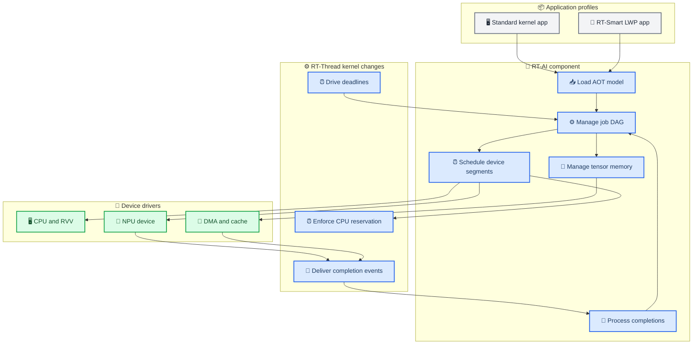
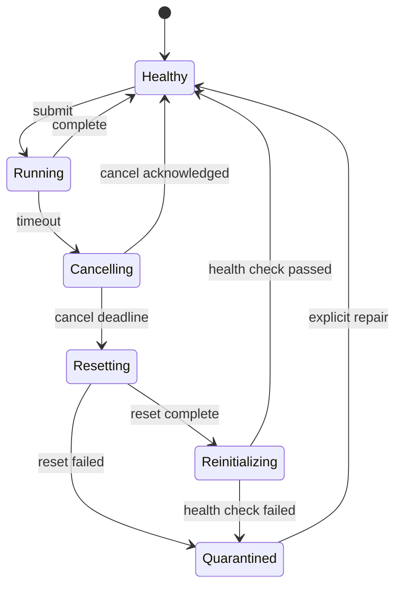

# 基于 RT-Thread 改造的原生 AI 操作系统

_面向内核调度、异构设备、张量内存和 RT-Smart 用户态的工程研究方案 · 2026-08-04_

---

## 摘要

本文提出在 RT-Thread 内核与组件体系内实现原生 AI 操作系统能力。AI inference 不再被视为一个普通线程调用的同步库，而被表示为包含 CPU、RVV、NPU 和 DMA segment 的异步作业 DAG。RT-Thread 固定优先级调度器继续保护控制任务；新增周期 CPU reservation 约束 AI CPU 时间；每个异步设备使用考虑 deadline 与非抢占 blocking 的 ready queue；tensor arena 按 cached、uncached/DMA 和 accelerator-local memory domain 分配；中断上半部只确认设备并投递 completion，工作线程完成依赖推进、cache ownership 转移和故障恢复。

当前项目已有约 2.5 KLOC 的独立 RT-AI C 原型，覆盖 job、EDF 队列、arena、cache hook、timeout 和 epoch-cookie 测试，但 RT-Thread 端口只有关中断、恢复中断和 tick 计时三个函数。该组件没有修改 RT-Thread scheduler、timer、IPC、memory、driver 或 LWP，也没有在真板运行；部分路径在全局关中断区内调用 provider，不能视为可部署内核设计。本文将研究贡献重新锚定在真实 RT-Thread fork：预算隔离的两级异构调度、编译器驱动的 tensor memory/coherency、可归属的异步完成与有界恢复，以及 Standard/Smart 双 profile API。

**关键词：** RT-Thread；RT-Smart；实时调度；NPU；异构 DAG；tensor arena；DMA coherency

## 📋 研究定位

### 为什么必须改操作系统

RT-Thread 当前项目锁定源码采用固定优先级抢占调度和同优先级时间片机制，线程、timer、IPC、memory、driver 和 LWP 分别由内核及组件提供。[^1] RT-AK 则是面向模型一键部署和平台插件的 AI kit，不负责对 RT-Thread scheduler、异步加速器、deadline budget 或多租户 tensor memory 做内核级管理。[^2]

经典实时调度理论主要处理 CPU task；PTask、StarPU 等系统将 accelerator 与 task graph 提升为运行时对象；PREMA、DREAM 等进一步研究 NPU 多任务与动态实时 workload。[^3][^4][^5][^6] 本文不声称首次提出 EDF、DAG 或 NPU 调度，而研究这些机制如何在资源受限 RT-Thread 中与固定优先级控制任务、静态 tensor arena、DMA/cache 和 RT-Smart LWP 形成一个可实现的内核/组件协同设计。

### 研究问题

1. **RQ1：** 周期 CPU reservation 能否在 AI 负载突发时保护固定优先级控制任务的 jitter 与 deadline？
2. **RQ2：** CPU reservation 与 per-device EDF 的两级调度能否降低异构 AI 作业的 p99 latency 和 miss rate？
3. **RQ3：** 编译器给出的 tensor lifetime 与 memory domain 能否降低峰值内存、copy 次数和 cache maintenance 开销？
4. **RQ4：** ISR/worker 分层、epoch-cookie 和有界 reset 能否在 timeout、迟到 IRQ 与设备故障下保持作业归属和系统可用性？
5. **RQ5：** 同一核心机制能否支持 RT-Thread Standard 内核 API 与 RT-Smart LWP 用户态 API？

### 范围与非目标

本文以 inference 为主，不实现通用 GPU OS、训练系统或任意设备抢占。设备没有硬件 preemption 时，segment 按非抢占资源建模；不能借用可抢占 NPU 论文的结果。hard deadline 结论只在 WCET、arrival、blocking、timer 精度和故障开销均被物理测量覆盖的任务域内成立。

## 🔍 当前实现审计

### 原型具有的价值

[`engine/rt_ai_templates`](../../engine/rt_ai_templates) 已实现可继续利用的组件原型：

- session/job/segment 与 CPU、RVV、NPU、DMA resource queue
- 基础 per-resource EDF 顺序与 DAG dependency mask
- tensor arena lease 和简单 first-fit 分配
- cache clean/invalidate/barrier provider hook
- timeout、cancel、reset、epoch-cookie 和 stale completion 拒绝
- host test、随机调度 oracle、QEMU cross compile 和 trace 输出

这些代码能作为算法测试台，但不能替代 RT-Thread 内核实现和真板驱动。

### 必须正视的工程问题

| 问题 | 当前代码位置 | 风险 | 改造方向 |
| --- | --- | --- | --- |
| 端口过薄 | `rt_ai_port_rtthread.c` | 未使用 thread/IPC/timer | 建立 RT-Thread component |
| 长关中断区 | `coordinator.c` | provider submit 位于锁内 | ISR/worker 与细粒度锁 |
| tick 计时 | `rt_tick_get()` | 微秒值只有 tick 精度 | 高精度 monotonic clock |
| 主动轮询 | `rt_ai_poll()` | 浪费 CPU、增加 jitter | event/timer 驱动 worker |
| 固定数组 | public header | 规模不可配、占内存 | Kconfig + slab/mempool |
| cache mock | host provider | 不代表真实 DMA | BSP cache/DMA adapter |
| 无设备模型 | provider callback | 无 irq/fence/reset contract | `rt_ai_device` ops |
| 无预算隔离 | 独立 EDF queue | AI 可干扰控制任务 | scheduler CPU reservation |
| 无 LWP | 仅内核 C API | RT-Smart 应用不可隔离 | syscall/ioctl/mmap |
| 无真板数据 | host/QEMU test | 不能声明实时性能 | K230 与第二板 HIL |

当前 [`rt_ai_poll()`](../../engine/rt_ai_templates/os/coordinator.c) 先调用 `rt_ai_port_lock()` 全局关中断，然后执行恢复、遍历作业、coherency hook、trace 和 `provider->submit()`。即使 host 测试通过，这种锁范围也必须在产品化前重构；真实 NPU/DMA submit 可能访问 MMIO、等待队列或触发较长路径。

## ⚙️ 操作系统架构

### 分层设计



### 两级调度原则

第一层仍是 RT-Thread thread scheduler。硬实时或高优先级控制线程按现有 fixed-priority 语义运行；AI CPU/RVV 工作只在附着 periodic reservation 的 worker 中执行。第二层是 `rt_ai` component，对 NPU、DMA 和 CPU reservation 的 segment 按依赖、absolute deadline 和设备状态调度。

这种分层避免把所有 RT-Thread 线程改成 EDF，也避免 AI runtime 绕过内核优先级。OS 研究点是让 CPU reservation 成为 scheduler 可计费、可 throttle、可 replenishment 的内核对象，而不是在用户库中靠 sleep 模拟。

## 🔧 六项实质改造

### 内核 CPU reservation

第一版采用一条 AI worker 对应一个周期 reservation，不宣称实现完整 Constant Bandwidth Server。新增 `struct rt_sched_reservation`，挂在 `RT_SCHED_THREAD_CTX` 的条件编译字段中：

```c
struct rt_sched_reservation {
    struct rt_spinlock lock;
    rt_uint64_t budget_ns;
    rt_uint64_t period_ns;
    rt_uint64_t remaining_ns;
    rt_uint64_t next_replenish_ns;
    rt_uint64_t last_start_ns;
    struct rt_thread *owner;
    rt_list_t throttled_node;
    rt_uint32_t generation;
    rt_uint8_t state;
    rt_uint8_t active_cpu;
};
```

时间基准必须来自跨 DVFS 稳定、跨核同步的单调 counter，例如 RISC-V `time`/平台 `mtime`，不能直接用受频率变化影响的 `cycle` 计时。architecture/BSP port 提供 `rt_sched_clock_read_ns()`、`rt_sched_timer_program(abs_ns)` 和 `rt_sched_timer_cancel()`；不存在合格时钟源或 one-shot timer 的平台不启用纳秒 reservation。

调度器在 worker switch-in 时记录 `last_start_ns`，并把 one-shot 绝对到期时刻设为 `min(now + remaining_ns, next_kernel_event_ns)`；switch-out、预算 timer IRQ 和必要的 tick 路径都结算运行时间。若 reservation timer 与系统 tick 共用硬件 comparator，则由 per-CPU event mux 维护最近绝对事件并在 IRQ 后重新编程，不能让预算事件覆盖系统 tick。预算耗尽后，在 scheduler lock 内把 worker 从 ready queue 移入 throttled list并请求重调度；到 `next_replenish_ns` 后恢复 `budget_ns`、推进下一周期并重新入队。worker 长时间空闲后，补充逻辑一次跳过所有已过期周期，避免重复触发过期 timer。这样即使 AI worker 没有主动 yield，也不能越过一个 tick 才被节流。

所有 AI reservation worker 的固定优先级必须低于声明受保护的控制线程，否则预算隔离不能替代优先级分析。SMP 第一阶段把 reservation worker 固定到单核；第二阶段才允许迁移，并使用 per-CPU active reservation、同步时钟和带 generation 的迁移协议，保证同一 reservation 不会在两核同时计费。中断时间采用“保守计入被中断 AI worker”与“扣除 IRQ 时间”两种策略做消融，产品默认选择能给控制任务更强隔离的保守策略。周期 reservation 与 Constant Bandwidth Server 有理论联系，但本文重新建立 RT-Thread 实现的 supply bound、开销和实验结论，不直接继承 CBS 的保证。[^7]

最小内核 patch 涉及：

- `include/rtdef.h` / `include/rtsched.h`：reservation state、thread attachment 与 attach/detach/query API
- 新增 `src/sched_reservation.c`：计费、throttle、replenish 和 admission 参数检查
- `src/scheduler_up.c` / `src/scheduler_mp.c`：switch-in/out accounting、预算到期重调度和 SMP 约束
- `src/thread.c`：owner 生命周期、退出和 detach 清理
- `src/timer.c` / `src/clock.c`：与现有 tick timer 协调，但不把 tick timer 冒充高精度 one-shot
- `libcpu/<arch>/` 与 BSP timer driver：稳定 clocksource 和 per-CPU one-shot port

`RT_USING_SCHED_RESERVATION` 未启用时不增加 thread 字段、不改变 ready queue 和调度结果；上游 scheduler regression 必须逐项通过。

### 异构 DAG 与 per-device scheduler

模型编译器输出 \(G_j=(V_j,E_j)\)。每个 segment \(v\) 具有 resource \(r_v\)、WCET \(C_v\)、workspace、依赖和 absolute sub-deadline。编译器先按 critical path 和实测 WCET 给出候选 sub-deadline，OS admission 再按当前设备 blocking 校验；不能简单让所有 segment 共用一个 end-to-end deadline。ready segment 只进入对应 resource queue：

- CPU/RVV segment：进入 reservation worker
- NPU segment：进入 NPU 非抢占 EDF queue
- DMA segment：进入 DMA channel queue，并产生 fence
- 完成事件：解除后继依赖并唤醒下一资源

对非抢占资源，较晚 deadline 的活动 segment 会造成 blocking：

\[
B_r=\max\{C_v+O_v\mid v\text{ may already execute on }r\}
\]

单资源先使用 demand 与 blocking 做保守必要条件过滤：

\[
\forall t\in\mathcal H_r:\quad dbf_r(t)+B_r\le t
\]

CPU 侧还要求 demand 不超过周期 reservation 在区间 \(t\) 的 supply-bound function。由于 precedence、多 DMA channel 和非抢占设备会破坏简单单资源充分性，最终 admission 使用冻结参数的有限 horizon event simulation；上式本身不称为充分证明。只有在已知 arrival、WCET、blocking、timer 和 recovery overhead 下，该流程才支持条件化 deadline 结论；未知 NPU 执行时间时只能使用 best-effort profile。

### Tensor memory domain

在 `components/rt_ai/memory/` 新增 `rt_ai_mem_domain`：

- `cached`：普通 CPU activation
- `dma_coherent`：硬件一致或 uncached pool
- `dma_streaming`：需要显式 ownership transfer
- `device_local`：NPU/SRAM window
- `constant`：只读模型权重

TVM 编译器给出 tensor offset、size、alignment、lifetime 和 segment access。OS 在 session 创建时从 `rt_memheap`、page allocator 或板级 reserved memory 建立 arena；运行时不再为每个 op 动态 malloc。跨 session 并发使用 per-session quota 和共享常量引用计数。

对 streaming DMA，状态机至少为：

```text
CPU_OWNED_DIRTY -> CLEAN_FOR_DEVICE -> DEVICE_OWNED
DEVICE_OWNED_DIRTY -> INVALIDATE_FOR_CPU -> CPU_OWNED_CLEAN
```

每个 transition 同时检查访问方向、cache line 对齐、alias、barrier 和 fence。设备只读 buffer 不进入 `DEVICE_OWNED_DIRTY`；共享 cache line 的两个 tensor 禁止跨 owner 并发。clean/invalidate 和 device fence 必须由 BSP adapter 执行。Linux DMA API 可作为 ownership 语义参考，但 RT-Thread 需要按实际 SoC cache controller 实现，不能直接复制 Linux API 就假定正确。[^8]

### 设备模型与中断分层

将松散 provider callback 改为 RT-Thread device 风格接口：

```c
struct rt_ai_device_ops {
    rt_err_t (*get_caps)(struct rt_ai_device *, struct rt_ai_device_caps *);
    rt_err_t (*submit)(struct rt_ai_device *, const struct ai_segment_desc *, rt_uint32_t cookie);
    rt_err_t (*cancel)(struct rt_ai_device *, rt_uint32_t cookie);
    rt_err_t (*query)(struct rt_ai_device *, struct rt_ai_status *);
    rt_err_t (*reset)(struct rt_ai_device *);
    rt_err_t (*map_buffer)(struct rt_ai_device *, struct rt_ai_buffer *);
    rt_err_t (*unmap_buffer)(struct rt_ai_device *, struct rt_ai_buffer *);
};
```

ISR top half 只完成：读取/清除状态、捕获 `device_id/epoch/cookie/status/timestamp`、写入预分配的 per-device SPSC ring，并用 ISR-safe event/semaphore 唤醒 worker。SPSC 前提是设备 IRQ 固定到一个 core；多生产者平台改用 per-CPU ring。ring 满时递增饱和 overflow counter、屏蔽该设备 IRQ并触发受控恢复，不能覆盖尚未消费的 completion。completion worker 在 thread context 中执行 cache transition、DAG 推进、trace、唤醒 waiter 和下一次 dispatch。禁止在全局关中断区执行 provider submit、reset、内存分配或长循环。设备不支持 cancel 时明确返回 `-RT_ENOSYS`，恢复器按策略等待有界完成或执行 reset，不能把软件状态改成 cancelled 后立即复用 buffer。

### 超时、取消和有界恢复

每次提交携带递增 cookie，设备每次 reset 携带递增 epoch。completion 只有同时匹配 active `(device, epoch, cookie)` 才能改变 job 状态。恢复状态机为：



cancel、reset、reinit 都有板级测量上界；超界后设备进入 quarantine，后续作业选择 CPU/RVV fallback 或失败返回。fallback 必须重新进行内存和调度检查，不能在故障处理中直接跳转执行。

### Standard 与 RT-Smart 双 profile

RT-Thread Standard 提供内核 C API：

```text
rt_ai_model_register
rt_ai_session_create
rt_ai_submit
rt_ai_wait
rt_ai_cancel
rt_ai_buffer_alloc
```

RT-Smart 首版通过 DFS 字符设备 `/dev/rt-ai` 实现 `open/ioctl/mmap/poll/close`，不新增专用 syscall。只有在测得 DFS 路径开销不可接受后，才以同一 ABI 增加 syscall fast path：

- `AI_LOAD`：验证并映射模型常量
- `AI_ALLOC`：按 process quota 分配 tensor buffer
- `AI_SUBMIT`：用 `lwp_get_from_user` 复制固定大小 descriptor，只接受 `AI_ALLOC` 返回的 handle
- `AI_WAIT`：支持 timeout 与 signal interruption
- `AI_CANCEL`：只取消调用者拥有的 job
- `mmap`：经现有 DFS `mmap2` 路径映射已授权 shared/DMA buffer，不暴露任意物理地址

首版拒绝任意用户指针的 pin/map，避免在 RT-Smart MMU、cache 和进程退出语义尚未闭合时制造悬空 DMA。每个 LWP 具有 session、buffer、job 和 device time quota；AI handle 接入现有 `lwp_user_object_add/delete/clear` 生命周期，`close` 与 process cleanup 自动取消 job，等待有界 fence，无法停止的设备进入 reset/quarantine 后再释放映射。Standard 与 Smart 共用 component scheduler、device driver 和 memory domain，不维护两套 AI runtime。

## 👥 多 Agent 实现组织

该 RT-Thread fork 由项目内多 Agent 自主开发。每个 Agent 操作隔离 patch series，确定性 runner 负责编译、仿真、真板和基准测试。

| Agent | 主要修改 | 交付物 | 独立测试 |
| --- | --- | --- | --- |
| Kernel Agent | scheduler/thread/timer | reservation patch | scheduler unit/stress |
| Runtime Agent | job/DAG/queue | `components/rt_ai` | oracle comparison |
| Memory Agent | mem domain/cache | arena/coherency patch | corruption/fuzz |
| Driver Agent | NPU/DMA/IRQ | device ops + BSP port | loopback/fault HIL |
| Smart Agent | LWP/syscall/mmap | user API | process isolation |
| Compiler Liaison | model ABI | TVM-OS interface | model round-trip |
| Performance Agent | timer/trace/PM | benchmark runner | overhead calibration |
| Verification Agent | adversarial scenarios | regression suite | independent oracle |

Kernel Agent 不得同时决定其 scheduler 测试通过；Verification Agent 使用独立作业生成器和参考 simulator。多 Agent 是实施方式，论文贡献仍由内核机制、可调度分析、内存/设备语义和实验结果构成。

## 📍 工程实施路线

### 目标目录

```text
os/rtthread_ai/
  upstream.lock
  patches/kernel/
  patches/smart/
  components/rt_ai/
    core/
    sched/
    memory/
    trace/
  drivers/rt_ai/
  ports/qemu_virt64/
  ports/canaan_k230/
  tests/kernel/
  tests/hil/
```

[`engine/rt_ai_tools.py`](../../engine/rt_ai_tools.py) 最终只创建 fork worktree、应用 patch、配置 Kconfig、调用 SCons/Make 和收集测试结果。它不再复制 `engine/rt_ai_templates` 到产品目录。

### 八个里程碑

| 阶段 | 实现范围 | 可运行出口 | 完成判据 |
| --- | --- | --- | --- |
| O0 | fork/patch 构建 | 上游 RT-Thread | clean build/selftest |
| O1 | event-driven component | CPU async job | 无主动 polling |
| O2 | device/IRQ model | DMA/NPU loopback | ISR latency 可测 |
| O3 | tensor memory domain | zero-copy arena | cache negative test |
| O4 | periodic CPU reservation | AI temporal isolation | 控制 jitter 实验 |
| O5 | DAG/device EDF | 异构 pipeline | oracle 一致 |
| O6 | RT-Smart LWP API | user process inference | quota/exit isolation |
| O7 | recovery/PM/trace | 产品系统 | 24 h HIL 与故障注入 |

O0-O3 构成工程可用的 RT-Thread AI component；O4-O7 才能支撑“原生 AI 操作系统”的论文主张。

## 🧪 实验设计

### 平台与负载

主平台为 CanMV-K230，至少增加一块不同厂商 RT-Thread 板。QEMU virt64 用于 kernel regression 和调度 oracle，不用于物理 IRQ、cache、energy 或 deadline 性能结论。

AI workload 与编译器论文共享模型，同时加入三类实时干扰：

- 1 kHz 控制线程，记录 release-to-run jitter
- camera capture/display pipeline，产生周期 DMA 与 frame deadline
- 两到八个不同 deadline、模型大小和设备偏好的 inference client

生成轻载到过载的 arrival trace，并冻结随机 seed、WCET profile、设备频率和 memory pool。

### 基线与消融

| 维度 | 基线 | 完整系统 | 研究作用 |
| --- | --- | --- | --- |
| CPU 隔离 | 普通 AI worker | periodic reservation | 控制 jitter |
| 设备队列 | FIFO | per-device EDF | deadline miss |
| 作业模型 | 单同步模型 | async DAG | overlap/utilization |
| 内存 | malloc/copy | static domain arena | peak/copy |
| 完成路径 | poll | ISR + worker | CPU/IRQ overhead |
| 恢复 | timeout return | epoch/reset/quarantine | fault containment |
| 用户态 | 单内核 app | RT-Smart multi-LWP | isolation |

RT-AK 作为模型部署/API 的工程基线；FIFO、fixed priority、EDF、普通 worker 和 periodic reservation 作为调度基线。PREMA 只在硬件确实支持抢占时比较，否则仅作为相关工作。[^2][^5]

### 核心实验

1. **E1：预算隔离**：扫 AI reservation \(Q/P\)，测控制 jitter、AI miss rate、吞吐与预算 overshoot
2. **E2：异构 DAG**：CPU/RVV/NPU/DMA 不同映射下比较 FIFO、priority、EDF 和完整调度
3. **E3：内存/coherency**：随机 lifetime、并发 session、碎片和故意缺 clean/invalidate 的负对照
4. **E4：IRQ 路径**：测 top-half cycles、completion latency、ring overflow 和高频中断下控制 jitter
5. **E5：故障恢复**：注入 timeout、duplicate/late IRQ、cancel failure、reset failure 和 device offline
6. **E6：RT-Smart 隔离**：恶意/崩溃 LWP、越界 buffer、超 quota 和 process exit
7. **E7：长时产品负载**：camera-inference-display 与网络/MicroPython 并行运行 24 h

### 指标与统计

- 控制线程 release jitter、response time 和 deadline miss rate
- AI job p50/p95/p99 latency、miss rate、throughput 与 device utilization
- scheduler/submit/ISR/completion/context-switch cycles
- reservation 计费误差、预算 overshoot、replenishment latency 和跨核迁移误差
- peak tensor memory、external fragmentation、copy bytes 和 cache operation bytes
- stale completion acceptance、wrong-job completion 和跨 session corruption
- cancel/reset/reinit time、quarantine 次数和恢复后可用率
- RT-Smart syscall latency、per-process quota violation 和 cleanup time
- energy/inference 与整机功耗

实时结果报告完整分布和最大值，不只报告均值。每种随机任务集至少 1,000 个 trace；物理板每条件至少 30 次独立启动。比例使用 Wilson/Clopper-Pearson 区间，连续指标使用分层 bootstrap 95% CI；调度策略在同一 trace 上配对比较。

### 预注册假设

- **H1：** 在可接纳负载内，periodic reservation 使 1 kHz 控制任务 miss rate 与 control-only 基线一致，并显著降低普通 AI worker 下的最坏 jitter
- **H2：** per-device EDF+DAG 相对 FIFO 降低 AI deadline miss rate，同时吞吐不劣于 5%
- **H3：** static domain arena 降低 peak memory 和 copy bytes，随机压力下跨 session corruption 为 0
- **H4：** 设计域内所有 late/duplicate completion 均不改变新作业状态，恢复时间不超过冻结上界
- **H5：** 完整 OS 路径的中位 submit+schedule overhead 小于最短模型执行时间的 5%

H1 的“0 miss”只适用于预先通过 admission 且 WCET 未被低估的测试域。若 WCET profile 被超出，应报告敏感性曲线而不是继续声称 hard real-time。

## ⚠️ 可证伪边界

- 只有独立 runtime component、没有 RT-Thread kernel patch，不能称为原生 AI OS
- 只在 context switch 读取 counter、没有 one-shot budget expiry 的实现不能声称提供高精度 CPU reservation
- 在全局关中断区调用 provider 或 reset 的实现不得进入物理产品实验
- host mock 的 cache test 不能替代真实 non-coherent DMA 负对照
- EDF 平均延迟更低但控制任务 jitter 恶化时，系统设计判定失败
- 不支持 hardware preemption 的 NPU 不能使用可抢占分析结果
- RT-Smart API 若没有地址验证、quota 和进程退出清理，不能声称用户态隔离
- QEMU 与串口日志只能证明路径执行，不能证明 WCET、功耗或 cache correctness
- 多 Agent 数量、对话轮数和生成文件数量不构成 OS 贡献

## 🔗 参考资料

[^1]: RT-Thread Project. (2026). "RT-Thread kernel and component source at the project-pinned revision." <https://github.com/RT-Thread/rt-thread/tree/f42337ba03a7b39d089e561bf68f28378f93c46e>

[^2]: RT-Thread Project. (2023). "RT-AK: RT-Thread AI Kit." <https://github.com/RT-Thread/RT-AK>

[^3]: Liu, C. L. and Layland, J. W. (1973). "Scheduling Algorithms for Multiprogramming in a Hard-Real-Time Environment." _Journal of the ACM_. <https://doi.org/10.1145/321738.321743>

[^4]: Rossbach, C. J. et al. (2011). "PTask: Operating System Abstractions to Manage GPUs as Compute Devices." _SOSP_. <https://doi.org/10.1145/2043556.2043579>

[^5]: Choi, Y. and Rhu, M. (2020). "PREMA: A Predictive Multi-Task Scheduling Algorithm for Preemptible Neural Processing Units." _HPCA_. <https://doi.org/10.1109/HPCA47549.2020.00027>

[^6]: Kim, S. et al. (2023). "DREAM: A Dynamic Scheduler for Dynamic Real-Time Multi-Model ML Workloads." _CODES+ISSS_. <https://doi.org/10.1145/3623278.3624753>

[^7]: Abeni, L. and Buttazzo, G. (1998). "Integrating Multimedia Applications in Hard Real-Time Systems." _RTSS_. <https://doi.org/10.1109/REAL.1998.739726>

[^8]: Linux Kernel Project. (2026). "Dynamic DMA Mapping Guide." <https://docs.kernel.org/core-api/dma-api.html>

---

_本方案以 RT-Thread scheduler、timer、IPC、memory、driver 和 LWP 的真实源码改造为中心；外围运行时只有在这些内核/组件路径上运行后才构成原生 AI OS。_
