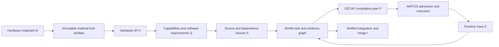

# ADAM-CECAP-AIRTOS 三篇论文统一理论框架

> 按当前仓库真实生产链重新推导的三篇题目、核心思想、行业难点、创新、数学理论、逐实验验证与突出贡献，见 [项目特征重分析](project_specific_reanalysis.md)。

## 0. 文档定位

本文定义三篇论文共同使用的研究对象、证据语义、理论依赖和声明边界。它是论文写作与实验设计的规范，不是实验结果报告。凡标记为“理论目标”的机制，必须在实现和实验完成后才能写成系统能力；凡标记为“当前实现”的机制，也只能在其实际适用域内主张。

三篇论文回答三个不同问题：

1. **ADAM**：如何让多个工程 Agent 在来源不完备、任务跨层且工具可能失败的条件下，安全地产生、验证和晋升 SoC 软件工件？
2. **CECAP**：如何把硬件契约、异构映射、内存计划、回退路径和验证证据统一为可检查的编译计划？
3. **AIRTOS**：如何在运行时依据计划适用域、证据、资源、时限和设备状态决定接纳、执行、取消或恢复？

三者共享“候选权与验收权分离”原则，但不共享同一个优化问题，也不互相代替证明责任。

### 0.1 三篇论文完整研究主线总览

下表是三篇论文必须在摘要、引言和贡献段保持一致的主线。行业难点来自截至 2026-08-03 完成的 78 个文献/规范来源核验，以及 2026-08-04 对当前仓库实现的复核，不是为配合方案反向虚构的问题；AIRTOS 软件子域已更新为 `SUPPORTED-WITHIN-SOFTWARE-MODEL`，ADAM/CECAP 与全部物理主张仍保持各自协议中的 `PRE-RESULT/EXPERIMENT-NOT-READY/BLOCKED-HIL`。

| 论文与题目 | 真实的当前行业难点 | 核心创新 | 数学理论骨架 | 实验如何验证 | 最突出的贡献 | 当前实现边界 |
|---|---|---|---|---|---|---|
| **ADAM**: *Evidence-Governed Agentic Co-Design for Hardware-Derived SoC Software Stacks* | 通用软件 Agent 已能使用工具、沙箱和角色流程，但真实 SoC 输入是带缺失、冲突和来源差异的材料；供应链 provenance、测试 oracle 和 Agent 协作仍是分离机制 [@hong2024metagpt; @yang2024sweagent; @wang2025openhands; @torresarias2019intoto; @barr2015oracle] | 硬件事实状态驱动 capability；Agent 只有候选权；owned-path、来源/ABI 闭包、claim-indexed evidence 和持久恢复共同控制工程效力 | 材料锁 \(\lambda\)、任务图 \(G=(V_T,E_D,E_R,E_V)\)、风险 \(\rho\)、证据债务 \(Debt\)、晋升谓词 \(Promote\)；证明不安全事实不激活、路径权限、依赖因果、相对验证器可靠性和有限调度终止 | **4 个核心实验**：事实/来源/任务图安全；候选与晋升安全；风险协作有效性；恢复与跨平台边界 | 给出一个允许不可靠 Agent 参与 SoC 候选生成、但不允许未经来源、权限和证据验证的候选进入集成树的控制面 | 主体机制已存在；`engine/control.py` 的 `material_selectors` 仍可从候选文本激活任务，因此“不安全事实不激活”目前是带前提定理 |
| **CECAP**: *Contract- and Evidence-Carrying Acceleration Plans for Hardware-Bounded Heterogeneous Edge AI* | TVM/MLIR/Ansor/TensorIR 等已成熟解决 IR、lowering 和调优，TinyML 系统已处理 arena/DMA；但编译器通常消费预设 target，代码产物不完整携带适用域、fallback 和逐义务证据 [@chen2018tvm; @lattner2021mlir; @zheng2020ansor; @feng2023tensorir; @burrello2021dory; @scherer2024deeploy] | 将 \(G,B,L,Q,S,M,D,F,\Omega,E\) 统一为消费者可拒绝的计划；来源状态约束合法空间；exact/beam 结论分离；编译变换不增信 | 合法性合取 \(Legal(P\mid H,W)\)、多目标支配、可采纳下界和 exact Pareto 保持、多维 evidence product、条件可执行与 fallback safety | **4 个核心实验**：合同与完整计划合法性；搜索正确性/质量；证据与 fallback 安全；多模型执行/真实性能 | 把异构编译结果从“代码选择”提升为带适用域、证据边界和独立 fallback、可由运行时审查的部署合同 | 固定 Add+ReLU 原型已生成 plan/evidence/policy v2、AEG v2 与独立 fallback，并与 AIRTOS hash/反馈合同收敛；通用模型、真实 NPU、真实 WCET 和正式实验未完成 |
| **AIRTOS**: *Evidence-Bounded Admission, Resource Governance, and Recovery for Heterogeneous Edge AI* | EDF、异构 DAG runtime 和 NPU 多租户已有大量工作，但非抢占 NPU/DMA、共享 SRAM、cache ownership、迟到 IRQ 与编译证据通常没有在 RTOS admission 中联合处理 [@liu1973scheduling; @rossbach2011ptask; @choi2020prema; @kim2023dream; @linux2026dmaapi] | 将 package/domain/evidence/provider/memory/coherency/WCET/recovery 合成一个准入谓词；lease 与 schedule 原子提交；epoch-cookie 隔离；trace 不自证 | \(Admit\) 合取、含非抢占 blocking/reservation 的 \(SimEDF^+\)、lease 不相交、coherency 状态机、epoch-cookie 接收谓词和有界恢复 | **4 个核心实验**：package/联合准入；调度/WCET/开销；内存/coherency；恢复/反馈/HIL | 给出一个让异构 AI 计划能够依据证据、适用域、资源、时限和设备代次被原子接纳、拒绝、恢复和追踪的 RTOS 治理层 | 逐义务 trust-bundle evaluation、多作业 `SimEDF+`/dbf、有限域 10,000 场景独立 oracle、预算恢复/quarantine/自动 fallback、cache 行为模型和 trace JSON 已有主机支撑；fallback 联合重新准入 gate 已实现，但扩域 oracle、正式竞争/故障 corpus、物理 DMA/cache 与 HIL 未完成 |

详细理论设计和逐实验协议分别见：

- [ADAM 理论设计](paper1_adam/theoretical_design.md)与[实验协议](paper1_adam/experiment_protocol.md)
- [CECAP 理论设计](paper2_cecap/theoretical_design.md)与[实验协议](paper2_cecap/experiment_protocol.md)
- [AIRTOS 理论设计](paper3_airtos/theoretical_design.md)与[实验协议](paper3_airtos/experiment_protocol.md)

## 1. 项目抽象

项目的生产路径只接受硬件材料，不接受预选 SDK、固件、defconfig、工具链、操作系统或预写目标契约。统一数据流为：

定义全局工程状态：

\[
X_t=(\lambda,H,Q,S,G_t,\mathcal{L}_t,I_t,B_t),
\]

其中：

- \(\lambda\)：材料内容哈希锁；
- \(H\)：带来源和事实状态的 Hardware IR；
- \(Q\)：硬件能力、未知项、冲突及软件需求；
- \(S\)：源码候选、许可证决策、ABI 一致性和传递依赖闭包；
- \(G_t\)：当前能力任务 DAG；
- \(\mathcal{L}_t\)：证据账本；
- \(I_t\)：只包含已晋升工件的集成状态；
- \(B_t\)：剩余实验、计算、设备写入和人工预算。

CECAP 的计划 \(P\) 是 \(I_t\) 中的一类工件；AIRTOS 的运行状态不并入编译状态，而作为执行时环境 \(R_t\) 单独建模。

## 2. 事实、声明与证据

### 2.1 硬件事实状态

每个硬件事实写为：

\[
f=(v,q,\Pi,C),
\]

其中 \(v\) 是值，\(q\) 是事实状态，\(\Pi\) 是来源定位和材料哈希集合，\(C\) 是附加约束。项目使用：

\[
\mathbb{Q}_f=\{authoritative,standard\_derived,board\_observed,candidate,unknown,conflict\}.
\]

安全谓词为：

\[
SafeFact(f)\iff q(f)\in\{authoritative,standard\_derived,board\_observed\}.
\]

这六个状态不是线性置信度。`authoritative`、`standard_derived` 和 `board_observed` 表示不同来源语义；`candidate` 不能因重复出现而自动晋升，`conflict` 也不能用多数表决消除。

### 2.2 声明及适用域

声明定义为：

\[
c=(\varphi,\Omega,\mathcal{O}),
\]

其中 \(\varphi\) 是可判定命题，\(\Omega\) 是适用域，\(\mathcal{O}\) 是证明义务集合。典型义务包括：来源、schema、构建、链接、数值一致性、资源边界、虚拟执行、物理执行、时限、压力、许可证和安全供应链。

适用域至少绑定以下适用项中与声明相关的部分：

\[
\Omega=(h_H,h_W,h_S,shape,dtype,layout,ABI,toolchain,runtime,environment).
\]

在一个适用域成立的声明，不能自动推广到更大的模型、形状、硬件版本、ABI、运行时状态或物理环境。

### 2.3 证据对象

证据对象定义为：

\[
e=(id,c,k,m,\Omega_e,h_{in},h_{out},p,v,r,t),
\]

其中 \(k\) 是证据种类，\(m\) 是产生方法，\(h_{in}\) 与 \(h_{out}\) 分别是输入和输出哈希，\(p\) 是生产者，\(v\) 是验证者，\(r\) 是结果，\(t\) 是时间或运行标识。

证据有效谓词为：

\[
Valid(e,c,X)\iff r=pass\land h_{in}=Hash(Input(c,X))\land
h_{out}=Hash(Artifact(c))\land \Omega_c\subseteq\Omega_e\land Authorized(p,v,k).
\]

E0-E6 仅作为验证环境强度的粗粒度标签：

| 等级 | 最低含义 | 不能自动推出 |
|---|---|---|
| E0 | 候选或无验证声明 | schema、可构建、正确性 |
| E1 | schema、静态检查、哈希或契约检查 | 可编译、可执行 |
| E2 | 编译、链接或代码生成通过 | 数值正确、板级正确 |
| E3 | 单元、差分、故障注入等主机证据 | RTOS 或物理板行为 |
| E4 | QEMU、Renode 或虚拟 RTOS 证据 | 物理时序、真实外设行为 |
| E5 | 物理板功能证据 | WCET、长期稳定性、性能优势 |
| E6 | 压力、尾延迟、能耗或长期性能证据 | 未覆盖适用域中的普遍正确性 |

等级不是完整的逻辑偏序。例如，物理板启动 E5 不能替代数值差分 E3，许可证证据也不能由运行证据替代。因此定义证据覆盖向量：

\[
Cov(E,c)[o]=\mathbb{1}[\exists e\in E:Valid(e,c,X)\land kind(e)=o],\quad o\in\mathcal{O}_c.
\]

只有所有必要维度均被覆盖，声明才可晋升：

\[
Promotable(c,E,X)\iff \bigwedge_{o\in\mathcal{O}_c}Cov(E,c)[o]=1.
\]

### 2.4 证据债务

令每项义务权重为 \(w_o>0\)，则声明的证据债务为：

\[
Debt(c,E)=\sum_{o\in\mathcal{O}_c}w_o(1-Cov(E,c)[o]).
\]

`Debt=0` 是晋升的必要条件，不是验证器绝对正确的证明。定理均相对于 schema、工具、验证器和硬件模型的可靠性假设成立。

## 3. 共同不变量

三篇论文共同采用以下不变量。

**I1 输入绑定。** 任务、源码锁、计划、运行包、镜像和证据必须可追溯到材料锁、Hardware IR 及相关策略的哈希。

**I2 候选与验收分离。** Agent、搜索器或模型可以提出候选；只有满足授权、适用域和证明义务的验证结果可以晋升候选。

**I3 不安全事实不激活能力。** 由 `candidate`、`unknown` 或 `conflict` 单独支撑的硬件字段不得启用代码生成、驱动、启动、加速器或发布能力。

**I4 来源闭包。** 构建输入不仅锁定顶层仓库，还必须锁定被选路径、许可证证据、submodule/repo-manifest 依赖及其修订。

**I5 权限约束。** Agent 的候选补丁只能修改其 owned paths；符号链接和路径穿越不能绕过该约束。

**I6 验证后晋升。** 候选在隔离环境验证，并在合入集成树后再次验证；失败、阻塞和未授权变更不能进入已晋升状态。

**I7 运行时不扩大编译声明。** AIRTOS 只能在 CECAP 声明的适用域和证据边界内接纳计划，不能通过一次成功运行自行提高计划证据等级。

**I8 反馈不自证。** 运行 trace 可以触发下一项实验，但不能同时充当实验选择器和该实验结论的独立证明。

## 4. 三篇论文的接口合同

| 生产者 | 消费者 | 必需对象 | 生产者证明 | 消费者仍需检查 |
|---|---|---|---|---|
| ADAM | CECAP | Hardware IR、软件需求、source lock、工具版本 | 来源闭包、哈希绑定、任务晋升 | 编译合法性、模型语义、计划适用域 |
| CECAP | AIRTOS | 计划、可执行段、内存图、fallback、证据清单 | 契约约束、代码生成、离线验证 | 当前资源、当前时限、设备 epoch、适用域匹配 |
| AIRTOS | ADAM | trace、失败类、运行环境、run ID | 事件归属、时间和设备状态 | 诊断可信度、下一实验价值、是否需要独立复现 |
| ADAM | 发布/镜像 | 已验证集成树、工件快照、来源树 | owned-path、依赖 DAG、验证结果 | 供应链、物理 HIL、发布策略 |

理论依赖方向为：

\[
ADAM_{contract}\rightarrow CECAP\rightarrow AIRTOS\rightarrow ADAM_{feedback}.
\]

这里存在控制闭环，但不存在证明循环。某一轮运行证据只能成为下一轮计划的输入，不能反向证明生成它的原计划。

## 5. 论文边界

### 5.1 ADAM 不主张

- 不证明某个编译计划数值正确或 Pareto 最优；
- 不证明运行时 deadline；
- 不把 LLM 输出视为证据；
- 不把固定角色数量写成理论必要条件。

### 5.2 CECAP 不主张

- 不证明 Agent 协作过程安全；
- 不承诺运行时资源始终可用；
- 不以编译期估计替代真实 WCET、板级正确性或长期稳定性；
- 不把有限 beam search 声称为无条件 Pareto 完备。

### 5.3 AIRTOS 不主张

- 不重新执行编译搜索；
- 不将运行时准入成功解释为编译器全域正确；
- 不从 QEMU 行为推出物理 NPU、DMA、cache 或中断时序；
- 不在缺少保守执行时间界时宣称 deadline safety。

## 6. 当前实现与理论目标

| 机制 | 当前状态 | 理论使用方式 |
|---|---|---|
| 材料内容锁与重复运行哈希检查 | 已实现 | 可作为 ADAM 输入不变式 |
| Hardware Fact 状态与安全能力激活 | 主路径已实现，但 `material_selectors` 可从候选文本触发 `source_stack_image` | ADAM 定理要求收紧该例外：文本选择器只能触发调查，不能直接授权可执行能力 |
| 来源搜索、许可证决策、ABI 一致性和依赖闭包 | 已实现主体 | 可作为 ADAM 来源闭包模型实例；需扩大目标覆盖 |
| SQLite 任务状态、输入哈希、失败签名和恢复 | 已实现 | 可作为 ADAM 状态机实例 |
| isolated worktree、owned paths、重复 verifier、晋升提交 | 已实现 | 支撑相对验证器的晋升安全；不等价于形式验证 |
| TVM Relax/S-TIR、CPU/RVV AOT、QEMU 差分与 RVV 指令检查 | 已实现于固定 Add+ReLU 原型 | 是 CECAP 可执行内核，不代表通用模型覆盖 |
| NPU ABI 缺失时阻塞并回退 | 已实现 | 支撑“未知 ABI 不生成 NPU blob”命题 |
| CECAP plan/evidence/policy v2、适用域、逐义务证据和 fallback | 已实现固定 Add+ReLU CPU/RVV 原型 | 支撑 CECAP-AIRTOS 合同接口；通用模型/shape/backend 覆盖与正式证据仍未完成 |
| AEG v2、段 DAG、WCET、domain、evidence/fallback/reservation/recovery 字段 | 已实现主机 loader/package，并由产品生成 trust bundle | runtime evaluator 已核对七类 binding hash、逐义务 scope/artifact/verifier hash、resource 和 verifier allowlist；artifact 文件重哈希与大规模 mutation 仍需正式实验 |
| per-resource EDF、per-job lease、coherency range/barrier、epoch-cookie | 已实现主机原型；allocator 有百万次 shadow-map stress，coherency 有缺 clean/invalidate 负对照 | 支撑 DAG、碎片化、代次冲突和最小非一致 cache 行为；不等于多线程 transaction 或物理 DMA/cache 证据 |
| 多作业 `SimEDF+`/dbf 与 generation transaction | 已实现重建全部 snapshot job、running residual、依赖 release、逐 job deadline 重验和 reservation/dbf | 独立 Python/C oracle 已在固定 seed 的 10,000 个有限域场景逐例一致；一般 DAG、running/dbf/tie/fallback 扩域和 5,000 stress 仍未完成 |
| cancel/reset/reinit poll、预算恢复、quarantine 与自动 fallback | 已实现 \(K_r=\texttt{max\_reset\_attempts}\) 的主机状态机；fallback 切换前重验 evidence/provider/active lease 与 `SimEDF+` | 支撑 gate 的实现 readiness；schedule-safe fallback 仍需真实竞争作业、生产 provider bound、fault seed 与 HIL 证据 |
| trace v2 与 trace-to-candidate feedback | chronological C ring、JSON exporter、event-level plan ID、Schema 和基础 metrics 已实现 | sequence/time/归属和不直接升证已有基础；事务事件、800 场景根因分类、macro-F1/top-k 与新计划 gate 实验仍未完成 |
| 唯一设备绑定、flash readback、有限重试、run-ID 归属 | 仿真路径已实现 | 可验证 HIL 协议；物理 HIL 仍为 blocked |
| 真实 NPU、真实板 WCET、能耗和长期压力证据 | 未完成 | 必须保持 TBD，不得由理论推导代替 |

## 7. 共同证明假设

所有定理必须显式引用所需假设，至少包括：

- **A1 哈希假设**：使用的内容哈希在研究规模下抗碰撞；
- **A2 解析器假设**：SVD/DTS/schema 解析器对所覆盖语法是可靠的；
- **A3 工具可信基**：编译器、链接器、仿真器、文件系统和 Git 操作按其规范运行；
- **A4 验证器可靠性**：验证器对声明义务是 sound 的，且测试适用域被准确记录；
- **A5 并发原子性**：任务状态更新、patch 晋升、lease 和运行时状态转移在规定锁范围内原子；
- **A6 硬件模型**：实际硬件满足被接纳的 Hardware IR、ABI、cache 和执行时间假设；
- **A7 故障模型**：只保证模型中列出的崩溃、超时、迟到中断、构建失败和设备复位，不保证任意恶意硬件或内核破坏。

论文中的“安全”应写成相对于这些假设和适用域的条件结论，而不是无条件系统正确性。

## 8. 统一评估原则

三篇论文共用以下实验纪律：

1. 现有自测试和虚拟执行只报告原型可运行性，不填充真实板性能、WCET 或能耗结果。
2. 每个结果同时报告目标、模型、shape、dtype、工具版本、源码修订、材料锁、运行环境和证据类型。
3. 正例与负例成对设计；仅报告成功样例不能验证拒绝安全。
4. 任何性能对比必须使用测得成本，不得使用当前 `cost.db` 中的 seed 值作为硬件性能数据。
5. 物理实验必须经过唯一设备绑定、写前确认、读回验证和 run-ID 归属。
6. 对照组、消融、失败样例和未完成项均保留，所有待测结果写为 TBD。

三篇论文的详细模型、算法、定理和实验分别见各目录下的 `theoretical_design.md`。

### 8.1 统一实验平台编号

| 编号 | 当前平台 | 用途 | 必须冻结的环境字段 | 不能支持 |
|---|---|---|---|---|
| Host-P0 | x86_64 Linux 6.8.0-136、Python 3.12.3、GCC 13.3 | 数据生成、oracle、native C/Python、并发/故障注入、reference | CPU/RAM、kernel、container digest、compiler flags、Git commit、affinity/governor | RISC-V 指令路径、物理 timing/DMA/cache |
| QEMU-P1 | RISC-V GCC 13.3、qemu-riscv64 与 qemu-system-riscv64 8.2.2 | RISC-V/RVV execution path、RTOS/boot 虚拟集成、objdump | QEMU/toolchain hash、machine/CPU flags、image、命令行 | 实板 latency、energy、真实 IRQ/reset/cache |
| Board-P2 | 单块 CanMV-K230-LP4 V3.0 | device binding、CPU/RVV 实测、DMA/cache、reset/IRQ、HIL | PCB revision、device/probe serial、firmware/image/readback hash、频率、温度、供电、仪器 | 板间差异和其他 SoC 的普遍性 |
| Agent-P3 | 待冻结的同一模型服务与 revision | ADAM Core-3 的协作成本/非劣效实验 | provider/model revision、参数、上下文、工具、预算、时间窗、服务变更 | 模型版本变化后的直接合并比较 |

正式运行时如任一版本不同，必须新建 platform block，不能沿用表中当前版本标签。

### 8.2 当前实验数据库存

| 论文 | 当前已有数据 | 当前不存在的正式数据 | 结论状态 |
|---|---|---|---|
| ADAM | QEMU DTS、K230 target/platform/product contracts、历史 build/failure 和内部 selftest case | `benchmarks/adam_codesignbench/v1/` 的 160 tasks、mutations、hidden oracle、model lock 与 fault/HIL manifest | 当前数据只用于素材构造和 smoke |
| CECAP | selftest 临时生成的固定 `add_relu_f32_8` plan/evidence/policy/AEG v2、CPU/RVV QEMU output | `benchmarks/cecap/v1/` 的 200 exact graphs、模型/输入/reference、mutation/fallback 和 measured cost | 固定域代码支撑，正式实验未就绪 |
| AIRTOS | `test_rt_ai.c` 固定 cases、`oracle.py` 即时 10,000 有限域场景、即时 allocator/cache/recovery/trace checks | `benchmarks/airtos/v1/` 的持久 package、一般 DAG、并发、coherency、fault/root-cause 和 HIL corpus | pilot/readiness，不是论文结果 |

三个 `benchmarks/.../v1/` 和 `results/{adam,cecap,airtos}/` 目录截至 2026-08-04 均不存在。正式数据必须由冻结 manifest 生成并内容寻址；不得从 `build/` 挑选成功样例拼成正式数据集。

### 8.3 正式实验禁用 mock 的证据规则

确认性实验不使用 mock/stub provider、mock device、凭空生成的 toy workload、合成性能成本或 selftest 计数作为论文证据。允许的对象包括：真实仓库任务和生产代码路径、公开真实模型/数据集、独立数学/规则 oracle、对真实 artifact 的受控 mutation、QEMU/离散事件/周期级模拟平台，以及 CanMV-K230 上的真实 OS/driver/device fault injection 与实测数据。模拟平台必须运行与实板同源的生产 artifact，并且只支撑其模型覆盖的结论。

- Host-P0 只有在运行项目真实 parser/compiler/runtime、真实 Git/worktree、真实线程/内存和真实 artifact 时才可产生软件不变量证据；替身 provider 的结果全部排除在 confirmatory n 之外。
- QEMU-P1 可作为正式的 ISA 执行、异常/中断入口、RTOS 集成和大规模可重复路径覆盖证据；Host 离散事件模拟可验证有限调度模型与独立 oracle 的一致性。二者均不得进入板级 latency、energy、WCET、物理 DMA/cache、reset 时界或 HIL 主结果。
- 独立 oracle 负责给出 expected decision/schedule/frontier，不替代系统执行；被测实现和 oracle 不得共享核心判定代码。
- mutation/fault injection 必须从真实材料、真实模型、真实计划或真实设备事件派生，并通过生产入口执行；纯手写 toy case 只可调试，不进入正式数据。
- CECAP 搜索质量的 confirmatory cost 只允许来自 Board-P2 的 `measured` 数据；AIRTOS 的模型一致性可由 Host/QEMU 扩大覆盖，但 deadline/WCET、coherency、reset/IRQ 和恢复时界主张必须由 Board-P2 实际 trace 锚定。
- 若真实 ABI、驱动、DMA 可观测性、reset 方法或仪器不具备，对应结果标记 `BLOCKED-HIL` 并删除主张，不以 mock 补齐。

### 8.4 单块 CanMV-K230 的共享物理验证合同

当前物理条件允许增加一块 **CanMV-K230-LP4 V3.0**。该板是三篇论文共享的技术验证平台，不是三个独立硬件样本；同一板上的百万次运行只能增加反例暴露机会，不能估计板间制造差异或外推到全部 K230/其他 SoC。

正式接入前冻结 `board_contract.json`：PCB revision、SoC/LPDDR 配置、device/probe serial、boot ROM/firmware/image hash、toolchain、CPU/RVV/NPU/DMA 能力来源、cache-line/coherency 属性、频率、温度/散热、供电、仪器型号和校准日期。板卡 revision、固件、频率或散热条件改变时必须新建 experiment block，不得并入原 block。

单板按以下顺序使用：

1. **设备资格检查**：读取 serial/版本，刷写最小诊断镜像并 readback，建立 host/device 双端 run ID；任一不匹配时停止物理分支。
2. **ADAM Core-4**：至少 30 次合法 build/flash/readback/run-attribution；错误设备、旧日志、错误 image hash 等危险负例只测试写入 gate，不真正刷写错误镜像。
3. **CECAP Core-4**：对冻结 model/shape 执行 CPU/RVV 数值差分与 10 warm-up+30 随机交错测量；只有获得权威 NPU command ABI/provider 后才加入 NPU 正分支。
4. **AIRTOS Core-3**：先以 coherency 负对照确认物理实验能观测 stale data，再执行至少 \(10^6\) 次 DMA transfer 和 24 h；若平台天然 coherent 或负对照不敏感，只能报告 transfer/hook 结果。
5. **AIRTOS Core-4**：fallback 重新准入代码和 Host fault corpus 均通过后，才运行同时满足 24 h 与 \(10^6\) jobs 的恢复/HIL；结束后再次 readback image hash。

三个论文阶段使用不同的 image hash、protocol hash、run-ID namespace 和结果目录；阶段之间重新上电并保存 readback。物理数据统一标记为单板重复测量，允许的结论是 `SUPPORTED-WITHIN-MODEL` 或 `BLOCKED-HIL`，不得写成跨设备普遍性。

## 9. 为什么该行业必须采用严格证据边界

边缘 SoC 软件同时具有五种使宽松论证失效的行业特征：输入材料不完备、软硬件版本快速分叉、编译与运行跨多个可信域、设备错误可能破坏共享内存或镜像、真实板资源稀缺且测试成本高。由此产生四个不能用平均成功率掩盖的后果：

1. **一次错误接纳可能不可逆。** 错误地址、IRQ、DMA 范围、cache 动作或 flash 目标会损坏设备状态，而不只是让一个测试失败。
2. **一次成功不能跨域外推。** 主机、QEMU、参考板和目标板具有不同 ABI、时序、中断、cache 和功耗条件；`runs once` 不是 deployment guarantee。
3. **工具链可能共同失效。** generator、candidate verifier 和 integration verifier 若共享解析器、oracle 或测试数据，就可能同时漏掉同一错误。
4. **时限和供应链声明具有审计责任。** hard deadline、许可证、来源闭包和发布资格都要求可追溯前提；模糊置信度无法回答哪项义务尚未完成。

因此，本项目把严谨性定义为四项可审计要求：声明有精确适用域、证据有对象和哈希绑定、结论有可证伪端点、未完成义务保持可见。严格性不是写作修饰，而是防止安全声明、性能声明和候选状态越权的系统机制。

## 10. Claim-evidence 二部图与证据产品

令声明集合为 \(\mathcal C\)，证据集合为 \(\mathcal E\)。声明与证据关系定义为：

\[
G_{CE}=(\mathcal C,\mathcal E,R),\qquad
(c,e)\in R\iff Valid(e,c,X)\land kind(e)\in\mathcal O_c.
\]

一条证据可以支持多个声明，但每条边都必须单独记录适用域与义务种类；“同一日志文件被多处引用”不等于每个声明都得到验证。对义务 \(o\) 定义局部状态：

\[
\mathbb L_o=\{\bot,pass,fail,conflict\},
\]

其中 \(\bot\) 表示无当前有效证据；只有正证据时为 `pass`；只有反证时为 `fail`；同时存在适用域相容的正反证时为 `conflict`。信息序为

\[
\bot\sqsubset pass\sqsubset conflict,\qquad
\bot\sqsubset fail\sqsubset conflict,
\]

而授权谓词只接受 `pass`，不把信息更多的 `conflict` 当作更高置信度。声明证据状态是产品：

\[
\mathbf L(c)=\prod_{o\in\mathcal O_c}\mathbb L_o,
\qquad
Promotable(c)\iff\forall o,\ \mathbf L(c)_o=pass.
\]

该定义给出三个严格后果：

- 一个维度的强证据不能填补另一维度，例如 physical boot 不能填补 numerical equivalence；
- `fail` 或 `conflict` 不能通过累加更多同类 `pass` 自动消失，必须解决反例、缩小适用域或生成新版本声明；
- 改变 model、shape、layout、precision、ABI、memory plan、toolchain 或 artifact hash 时，所有依赖该字段的坐标必须失效或重验。

证据债务相应改为：

\[
Debt(c)=\sum_{o\in\mathcal O_c}w_o\mathbb 1[\mathbf L(c)_o\ne pass],
\]

但 `Debt` 仅用于排序实验，不能替代逐坐标的晋升判定。

## 11. 验证器相关失效与独立性

为每个 verifier 定义失效域向量：

\[
FD(v)=(implementation,oracle,data,toolchain,environment,author).
\]

两次验证只有在论文预先指定的关键维度上具有不同失效域时，才可称为 `diverse verification`。同一命令重跑只验证可重复性；候选树和集成树使用同一个测试套件，主要验证上下文变化；它们都不自动给出统计独立性。

对错误声明 \(c=false\)，共同漏检率定义为：

\[
F_{joint}=\Pr[V_1=pass\land V_2=pass\mid c=false].
\]

实验必须直接通过带 hidden oracle 的缺陷注入估计 \(F_{joint}\) 及其区间。除非独立性经过设计和检验，否则禁止用 \(p_1p_2\) 或 \(p^2\) 推导双 verifier 可靠性。若关键安全端点观察到任何共同漏检，应逐例报告失效域和严重度，不能只报告总体均值。

## 12. 定理、实现与实验三层声明规则

每个核心主张必须带一个层级标签：

| 层级 | 允许回答的问题 | 必需材料 | 禁止越界 |
|---|---|---|---|
| `T` 理论层 | 在明确假设下性质是否可证明 | 定义、假设、定理、证明或证明路线 | 不能声称代码已经实现或真实平台已满足假设 |
| `I` 实现层 | 当前修订是否实现指定机制 | 代码路径、schema、测试和 artifact hash | 不能从单元测试推出全域正确或物理性质 |
| `E` 实验层 | 在预注册样本与平台上的效果大小 | 原始数据、统计分析、置信区间和失败样例 | 不能把未测结果、模拟值或 seed 写成实测结论 |

论文中的综合结论必须写成：

\[
Conclusion=Theorem\ assumptions\ satisfied
\land Implementation\ conformance
\land Experimental\ support\ in\ \Omega_{test}.
\]

任一层缺失时必须降级措辞。例如：仅有 `T` 时写“在 A1-A7 下可保证”；有 `I` 但无物理实验时写“原型实现并通过主机/QEMU 测试”；只有完成 `E` 后才能写“在所测平台上观察到”。

## 13. 预注册结论与结果锁

实验执行前冻结：协议版本、研究问题、主端点、样本纳入规则、随机种子生成规则、排除规则、停止条件、统计检验和成功阈值。冻结后计算协议哈希，并将任何偏离记录为 deviation；不得根据结果更换主端点。

“预取结论”只允许采用条件化模板：

- **支持模板**：若主端点满足阈值且置信区间、反例审计和多重比较规则均通过，则结论为“结果支持 Hx 在 \(\Omega_{test}\) 内成立”，不能写成全域证明。
- **不支持模板**：若阈值未满足，则结论为“当前数据不支持 Hx”；不得将其改写为“趋势性支持”。
- **安全失败模板**：关键 false acceptance、stale completion 或跨 lease corruption 任一非零，则对应安全实现声明失败，并进入根因/修复/重新预注册流程。
- **假设失效模板**：若实际执行超过 WCET、平台不满足 coherency 模型或 verifier oracle 被证伪，则结论指向前提或测量模型失效，而不是隐去样本。

三份执行协议分别见：

- `paper1_adam/experiment_protocol.md`
- `paper2_cecap/experiment_protocol.md`
- `paper3_airtos/experiment_protocol.md`
